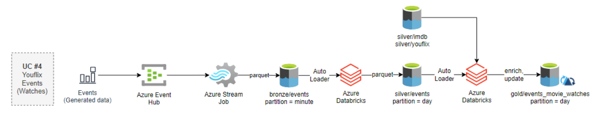

# Data Integration Mentoring Program

## General Architecture Overview

Data Lake for online video streaming platform - YouFlix. YouFlix is a content provider platform which is
looking for cloud-based solution for its analytic platform.

YouFlix users are watching movies available in the IMDB.
YouFlix users’ details and their subscriptions are available in the MSSQL Server DB. Metadata for all movies
available on YouFlix is stored as flat files (IMDB data).

There is also an API which returns several movies lists from
TMDB for users to help them make their choice for their next movie. Every time when YouFlix user is watching a
movie, the platform is generating an event.

### Sources:

1. MSSQL Server is YouFlix platform transactional database. It contains the data about users of the platform and
   their subscriptions.
2. IMDB is data set contains data about movies/series. Zipped csv files.
3. TMDB is the Movie DB API. Used in training to get and load several movie lists into data lake.
4. Events. By the scenario, YouFlix generates event each time user starts/finishes watching a movie. Events
   generation needs to be started manually, by mentee. Python script is used for events generation.

### Ingestion:

1. Azure Synapse Pipelines are used for full/incremental loading of the YouFlix DB data from MSSQL Server DB to
   Data Lake
2. Azure Synapse Pipelines are used to load IMDB csv files from Azure Blob Storage to Data Lake, converting it to
   parquet format.
3. Azure Function is used to invoke API calls to TMDB service to load several movie lists into Data Lake.
4. Azure Event Hub and Azure Stream Analytics are used to process streaming events data of YouFlix user’s movie
   watches.

### Useful Links:

- [Data Lake Design](https://learn.microsoft.com/en-us/azure/cloud-adoption-framework/scenarios/cloud-scale-analytics/best-practices/data-lake-zones)

## Use-Case 1

### Architecture:

1. Load latest YouFlix data from MS SQL Server database to the bronze layer in csv format without any
   transformations. You will use watermarks to identify changed data since last pipeline execution.
2. Merge data from the bronze layer into Delta Lake tables in the silver layer using Azure Databricks
   notebook.

### Useful Links:

- [Incremental Copy](https://learn.microsoft.com/en-us/azure/data-factory/tutorial-incremental-copy-overview)
- [Databricks Unmanaged Tables](https://learn.microsoft.com/en-us/azure/databricks/database-objects/#--what-is-an-unmanaged-table)
- [Upsert with `MERGE` in Delta Table](https://learn.microsoft.com/en-us/azure/databricks/delta/merge)

## Use-Case 2

### Architecture:

1. Copy IMDB files from initial storage to the bronze layer in Parquet format without any
   transformations.
2. Flatten the data according to the schema and other instructions and save it to the silver layer.

### Useful Links:

- [Data Flow Overview](https://learn.microsoft.com/en-us/azure/synapse-analytics/concepts-data-flow-overview)
- [Use File Metadata in Queries](https://learn.microsoft.com/en-us/azure/synapse-analytics/sql/query-specific-files)

## Use-Case 3

### Architecture:

1. In this use case, TMDB API will be used to ingest several movie lists into Data Lake. Ingestion should be
   implemented with Azure Function. The implemented function loads JSON files to the bronze layer and sends a
   custom event to the Event Grid Topic.
2. Synapse pipeline triggered by the custom event is to execute Azure Synapse
   Spark notebook and load processed data to the silver layer in Parquet format.

### Useful Links:

- [Event Grid Topic](https://learn.microsoft.com/en-us/azure/event-grid/custom-event-quickstart-portal#create-a-custom-topic)
- [Spark Notebooks in Azure Synapse](https://learn.microsoft.com/en-us/azure/synapse-analytics/spark/apache-spark-development-using-notebooks)

## Use-Case 4

### Architecture:

1. In this use case, you are to process the streaming data. YouFlix platform application generates events when a user
   begins watching a movie and at the end of watching. The event represents a record in JSON format.

2. For this use case, all the events are preliminarily generated. You are to start Python script to emulate events.
   Azure Event Hub is used to ingest streaming data.
3. Azure Stream Analytics job is used to extract data from Event Hub and land events to the bronze layer in parquet
   format partitioned by minute.

4. Finally, Azure Databricks is used to process events from bronze layer, perform quality checks, redirect wrong data
   to “quarantine/events” directory and saved cleaned and verified data to silver layer.

### Useful Links:

- [Stream Analytics Custom Partitioning](https://learn.microsoft.com/en-us/azure/stream-analytics/stream-analytics-custom-path-patterns-blob-storage-output)
- [Auto Loader](https://learn.microsoft.com/en-us/azure/databricks/ingestion/cloud-object-storage/auto-loader/)
- [Create Table
  `USING`](https://learn.microsoft.com/en-us/azure/databricks/sql/language-manual/sql-ref-syntax-ddl-create-table-using)

## Use-Case 5

### Architecture:

Microsoft have stated 3 use cases for SQL Serverless:

- Data Exploration.
- Logical Data Warehouse.
- Data Transformation.

The first case you tried when queried data from data lake in previous tasks in the program. In the current task, you
are to work with the second case - Logical Data Warehouse.

The logical data warehouse (LDW) pattern lays a lightweight virtualized relational layer on top of data that's stored
in a data lake or database. This virtualization layer provides data warehouse access without requiring data
movement. This solution can combine online transaction processing (OLTP) data with analytical data from data
lakes for a low-complexity, low-latency way to serve business intelligence (BI) and analytics workloads.

This architectural pattern can complement a tradition data warehouse by allowing data from disparate systems to
be viewed without movement or transformation. Whilst the traditional data warehouse may store a certain
amount of an organizations data, a Logical Data Warehouse may enable a more holistic approach by connecting
many other data sources that are not loaded into or are not appropriate to be loaded into a traditional data
warehouse.

### Useful Links:
- [External Table VS. View](https://www.serverlesssql.com/external-tables-vs-views-which-to-use/)
- [CETAS](https://learn.microsoft.com/en-us/azure/synapse-analytics/sql/develop-tables-cetas?source=recommendations#cetas-in-serverless-sql-pool)
- [Incremental Data Loading in LDWH](https://www.linkedin.com/pulse/logical-data-warehouse-azure-synapse-serverless-sql-atoui-wahid/)
- [Creating LDWH](https://learn.microsoft.com/en-us/azure/synapse-analytics/sql/tutorial-logical-data-warehouse)