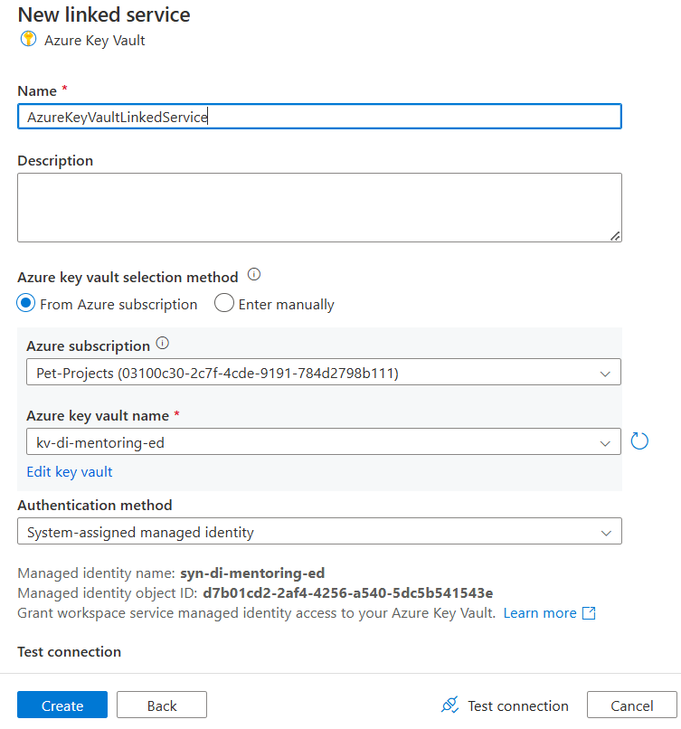

# Task 1.1

## Prerequisites:

1. Create and configure a self-hosted Integration Runtime in Synapse Analytics via UI to connect to MS SQL
Server. After creation, check the IR status. It should be Running.

2. Download files - `youflix.user.csv` and `youflix.user_subscription_device.csv` by the link.

3. Download the script `DeploymentScript.sql` by the link and replace `$(FullScriptDir)` with path to your files
from step 2.
4. In SSMS, connect to master database on your local MS SQL Server.
5. In SSMS, run the DeploymentScript.sql script on master database.

6. Go to your data lake `stdimentoringdatalakexx` and create “youflix” subfolder in “bronze” directory. This is a
destination folder in the first task (ingestion).

7. Go to your data lake `stdimentoringdatalakexx` and create “youflix” subfolder in “silver” directory. This is a
destination folder in the second task (processing).

## Steps to complete:

1. Create a linked service to your Azure Key Vault service. There are security requirements:
• Azure Key Vault name – your kv-di-mentoring-xx service.
• Authentication method - System Assigned Managed Identity
• Managed Identity Name - your syn-di-mentoring-xx service.

2. Create an Azure Table YouFlixWatermark in your storage account `stdimentoringdatalakexx` to store
watermarks.
3. Create entity for every source table:
• Use table name as a PartitionKey. RowKey can remain empty.
• Add property Watermark with Datetime data type to store timestamp of last load. Set the initial value
of the property `2000-01-01T00:00:00.00Z`.

4. Create a linked service to your Azure Table. Security requirements:
• Authentication method – SAS
• SAS URL should be stored in a separate Azure Key Vault secret. Use Account Key signing method when
you generate SAS, set Expiry date at least +1 year to the current date.
5. Create a linked service to your MS SQL Server `[YouflixDB]` database. There are requirements:
• Connect via integration runtime – your configured self-hosted IR from prerequisites.
• Store connection string in a separate Azure Key Vault secret.
• Authentication type – SQL authentication.
6. Create a linked service to Azure Data Lake Storage Gen 2. Security requirement:
• configure system-assigned managed identity authentication
• assign required permissions for Synapse Analytics to write files into Data Lake.

7. Create datasets for the source and sink. Source dataset(s) must be configured to read MS SQL Server tables.
Sink dataset should write csv files with the following settings:
• Escape character – Backslash (`\`).
• Quote character – Double quote (`“`).
• Column delimiter – Comma (`,`).
• First row as header – `True`.
• Compression type – `None`.
• Row delimiter – Default (`\r`,`\n`, or `\r\n`).
If there is no new data in source SQL table, empty file with header row should be still generated.

8. Create a pipeline with copy activity to incrementally load data from `[YouFlixDB]` to the `[data]` container in
data lake.
• Use Copy Activity to update table YouFlixWatermark with new watermark values.
• Use Copy Activity generate “Success.csv” file after successful load and place it into data lake in
“bronze/youflix”. The file should contain at least empty string inside.
• To reduce cost of your pipeline execution, specify Maximum data integration unit = 2 in each Copy Data
activity settings.