# Task 1.1 Synapse Pipeline with Copy Data Activity

## Prerequisites:

1. Creation and configuration a self-hosted Integration Runtime in Synapse Analytics via UI to connect to MS SQL
   Server.
   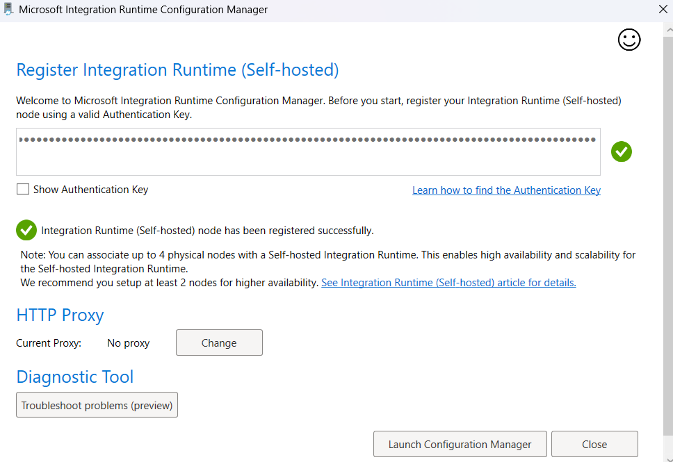
   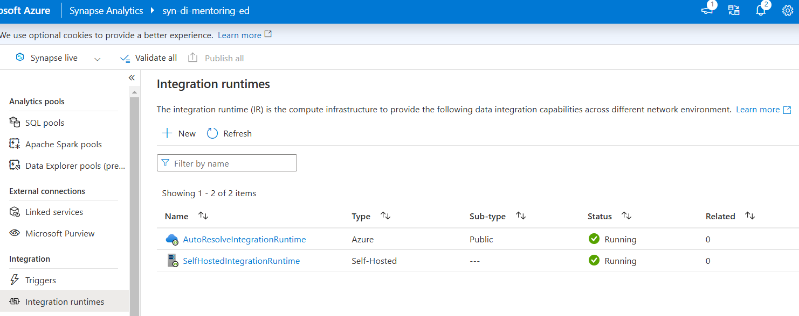
2. In SSMS, `DeploymentScript.sql` script was run on master database with data from `youflix.user.csv`,
   `youflix.user_subscription_device.csv`.
   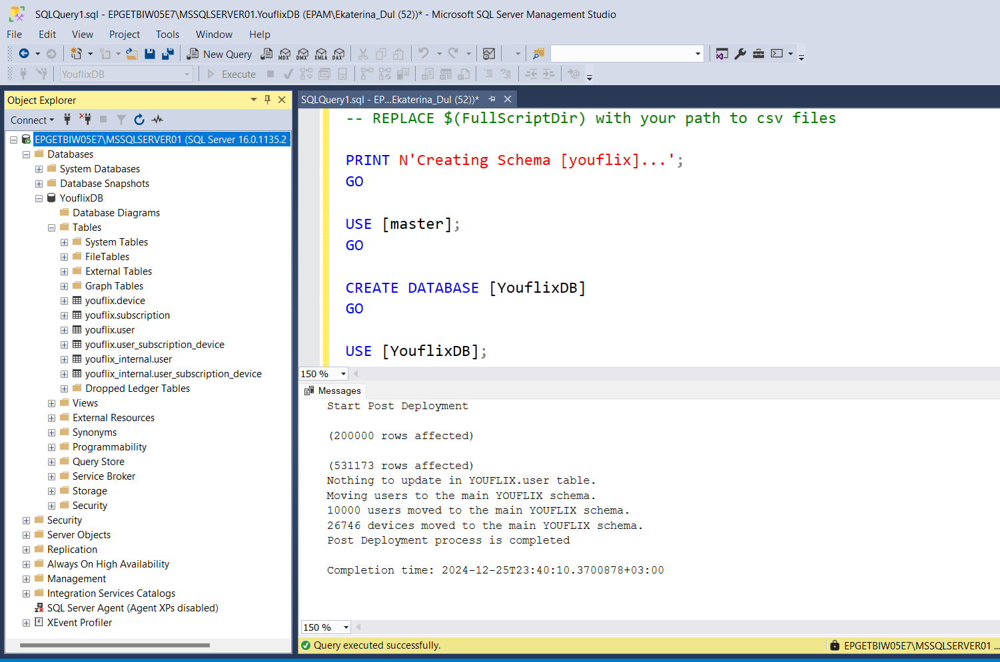

3. In data lake `stdimentoringdatalakexx` and created “youflix” subfolder in “bronze” and "silver" directories.
   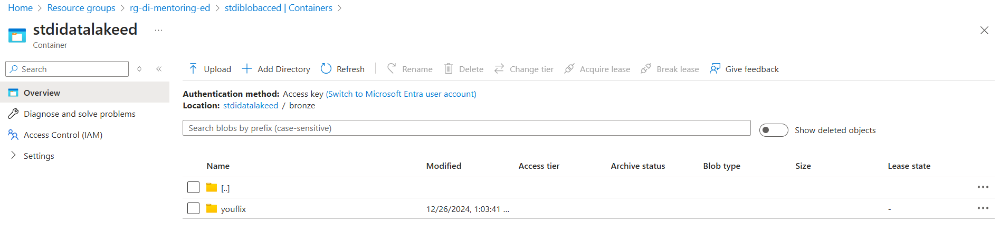
   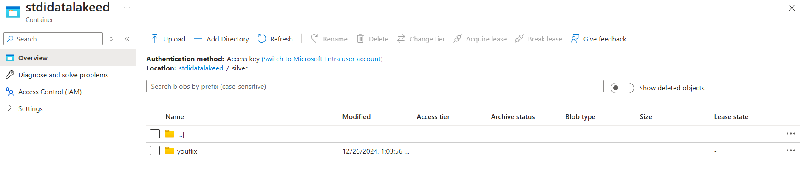

4. Creation of Synapse Studio linked services to AKV, Azure Table `YouFlixWatermark`, MS SQL Server tables and data
   lake.
   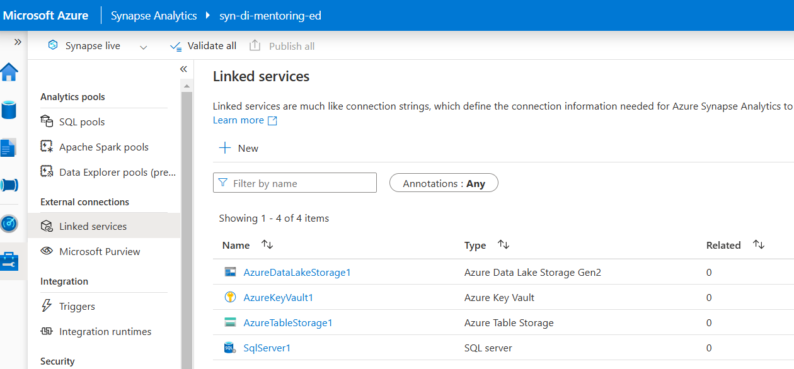

5. Creation entity for every source table in `YouFlixWatermark` Azure Table.
   

6. Creation of sink intergation datasets to data lake folders.
   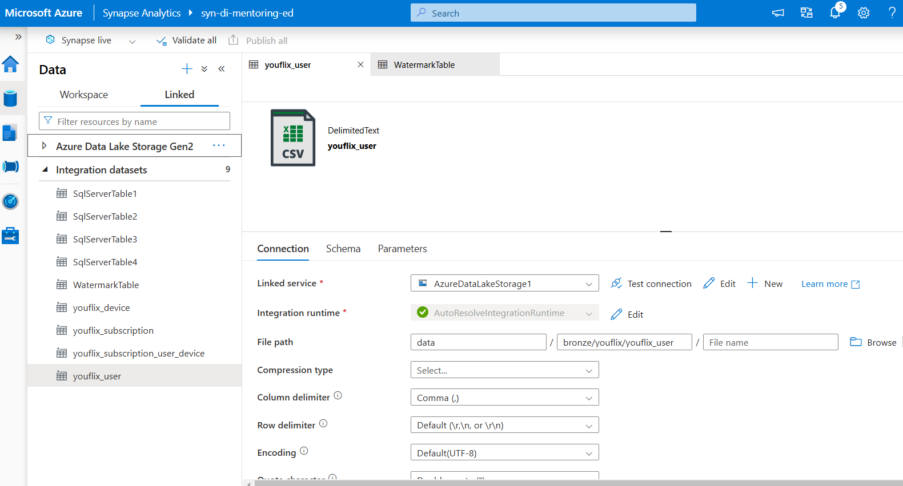
   File format:
   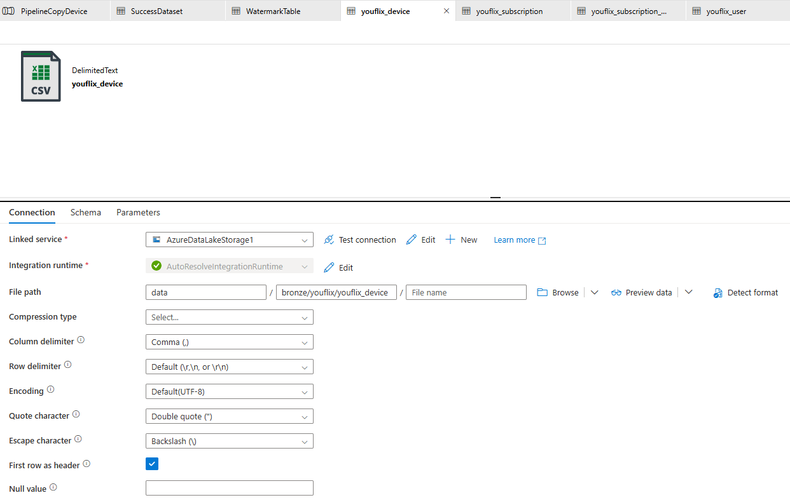

## Incremental Copy Pipeline for one table `youflix.device`:

1. `LookupOldWatermark` activity:
   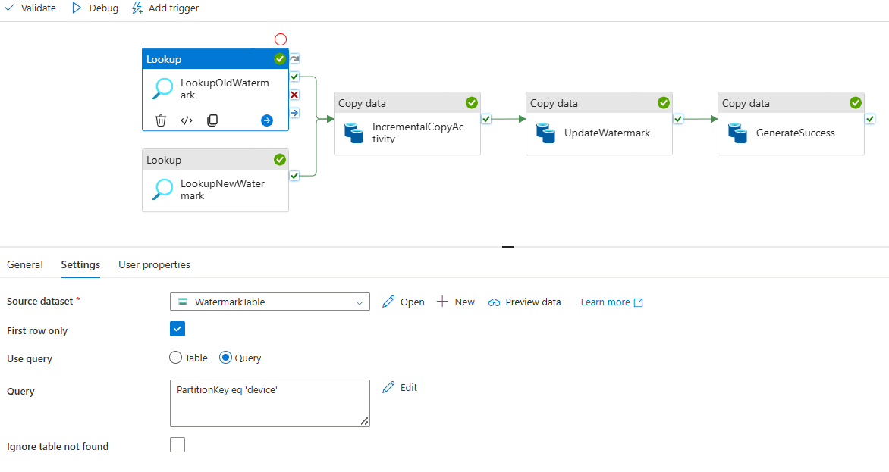
2. `LookupNewWatermark` activity:
   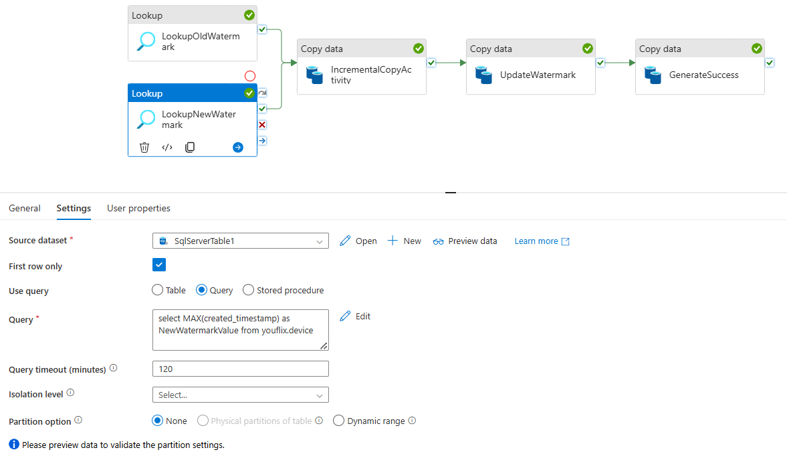
3. `IncrementalCopyActivity` source and sink:
   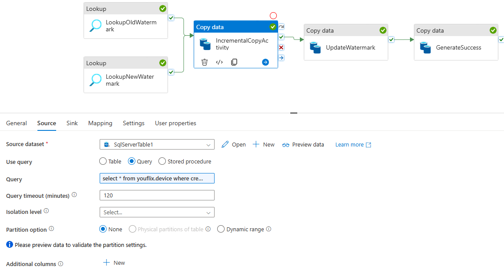
   Source query:
   ```sql
   select 
       * 
   from youflix.device 
   where 
       created_timestamp > '@{activity('LookupOldWatermark').output.firstRow.Watermark}' 
       and created_timestamp <= '@{activity('LookupNewWatermark').output.firstRow.NewWatermarkvalue}'
   ```
4. `UpdateWatermark` copy activity:
   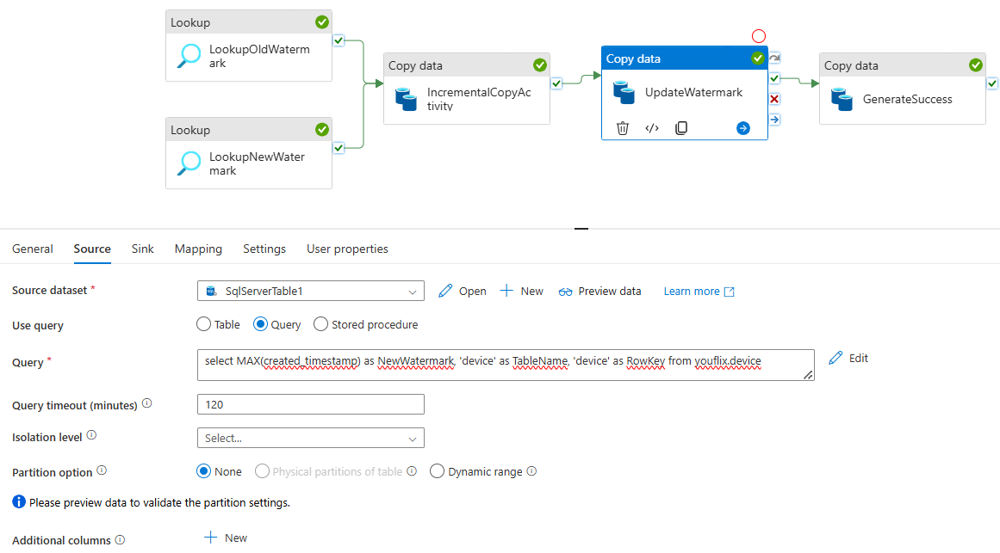
   
   Columns mapping:
   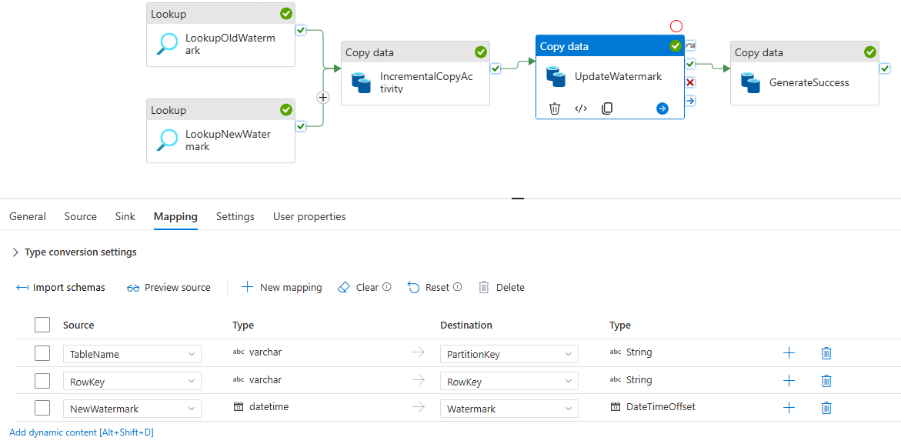
5. `GenerateSuccess` activity:
6. Pipeline with loading of `youflix.device` table run:
   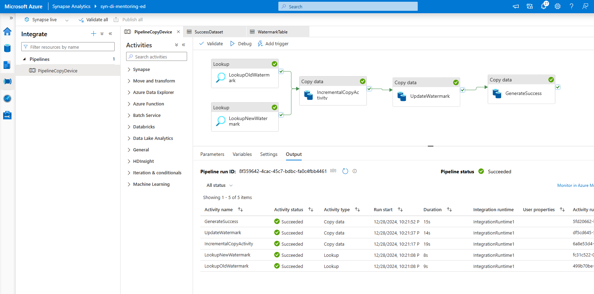
   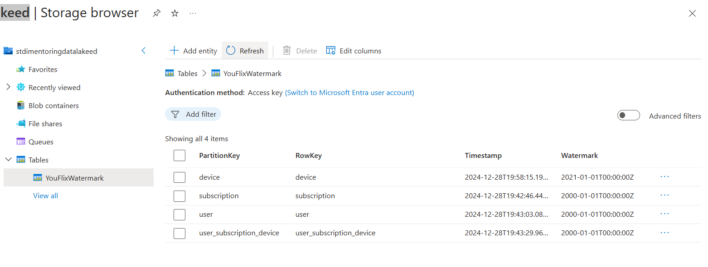
   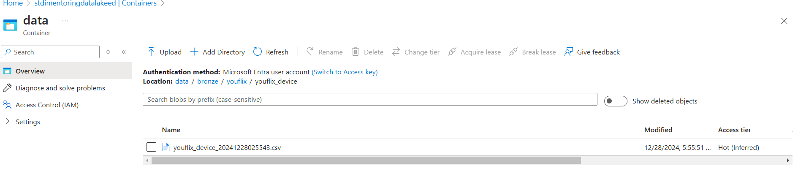

## Parameterized Incremental Copy Pipeline for one table `youflix.device`:

1. Pipeline parameters:
   `json
   [
       {
           "TABLE_NAME": "device"
       },
       {
           "TABLE_NAME": "user"
       },
       {
           "TABLE_NAME": "subscription"
       },
       {
           "TABLE_NAME": "user_subscription_device"
       }
   ]`
2. `LookupOldWatermark` activity:
   
3. `LookupNewWatermark` activity:
   
4. `IncrementalCopyActivity` source and sink:
   Source query:
```sql
select 
    * 
from youflix.@{item().TABLE_NAME
where 
    created_timestamp > '@{activity('LookupOldWatermark').output.firstRow.Watermark}' 
    and created_timestamp <= '@{activity('LookupNewWatermark').output.firstRow.NewWatermarkvalue}'
```

5. `UpdateWatermark` copy activity:
   
   
   Columns mapping:
   
6. `GenerateSuccess` activity:
   
   
7. Pipeline with loading of all `youflix` tables run:
   


## Run Scenario:

1. Before starting the run scenario, clear `“bronze/youflix”` folder and re-create `YouFlixDB` database from
   scratch using DeploymentScript.sql script. It is necessary to get rid of the results of your previous execution
   and testing activities.
2. Go to data lake `stdimentoringdatalakexx` and proceed to Storage browser, then click on Tables and edit
   each of entity by setting watermark value to `2000-01-01T00:00:00.00Z`.
   
3. Take screenshot(s) of your pipeline.
4. Go to your created pipeline and execute it manually.
5. Once the job succeeds, check `“bronze/youflix”` folder, it should contain 4 folders and `Success.csv` file.
6. Take screenshot(s) of the target folder.
   
7. Go inside each of 4 folders and take screenshot(s) of files generated.
8. In Synapse Workspace, navigate to Data section, find in Linked tab your container, open `“bronze/youflix”`
   and select top 10 rows for each file using SQL queries.
9. Take screenshot(s) of SQL queries and result output.
10. In Synapse Workspace, navigate to Data section, find in Linked tab your container, open `“bronze/youflix”`
    and check number of rows for each file using SQL query:

- youflix_device csv – 30
- youflix_subscription csv – 3
- youflix_user csv – 10000
- youflix_user_subscription_device csv – 26746

11. Take screenshot(s) of SQL queries with count values.
12. Go to your Azure Table and take a screenshot of new watermark values.
13. Without changing source data, execute your pipeline one more time.
14. In Synapse Workspace, navigate to Data section, find in Linked tab your container, open “bronze/youflix”
    and check number of rows for each newly loaded file using SQL query:

- youflix_device csv – 0
- youflix_subscription csv – 0
- youflix_user csv – 0
- youflix_user_subscription_device csv – 0

15. Take screenshot(s) of SQL queries with count values.
16. Connect to MS SQL Server YouFlixDB database and run the following command:
    EXEC youflix_internal.sp_youflix_tables_insert_update 10000, 15;
17. Execute pipeline manually again.
18. In Synapse Workspace, navigate to Data section, find in Linked tab your container, open “bronze/youflix”
    and check number of rows for each newly loaded file using SQL query:

- youflix_device csv – 0
- youflix_subscription csv – 0
- youflix_user csv – 10015
- youflix_user_subscription_device csv – 26596

19. Take screenshot(s) of SQL queries with count values.
