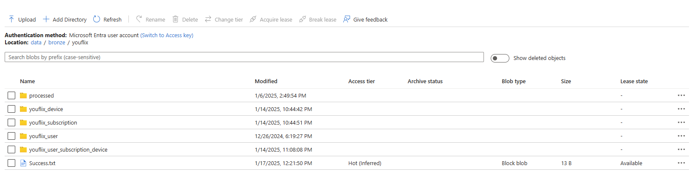
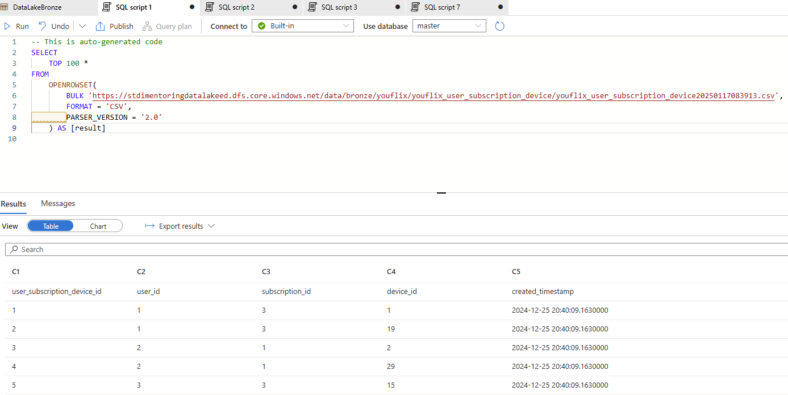
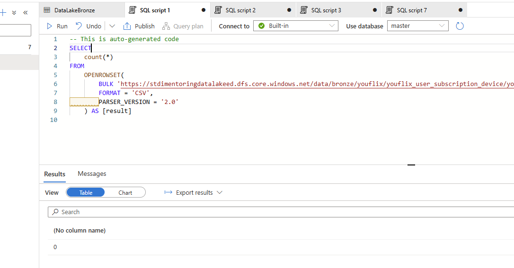

# Task 1.1 Synapse Pipeline with Copy Data Activity

## Run Scenario:

1. Before starting the run scenario, clear `bronze/youflix` folder and re-create `YouFlixDB` database from
   scratch using `DeploymentScript.sql` script. It is necessary to get rid of the results of your previous execution
   and testing activities.
2. Go to data lake `stdimentoringdatalakexx` and proceed to Storage browser, then click on Tables and edit
   each of entity by setting watermark value to `2000-01-01T00:00:00.00Z`.
   

3. Take screenshot(s) of your pipeline.
   
   
   
   
   Source query:
   ```sql
   select 
       * 
   from youflix.@{item().TABLE_NAME}
   where 
       created_timestamp > cast('@{activity('LookupOldWatermark').output.firstRow.Watermark}' as datetime2) 
       and created_timestamp <= cast('@{activity('LookupNewWatermark').output.firstRow.NewWatermarkvalue}' as datetime2)
   ```
   
   
   
   
   
   

4. Go to your created pipeline and execute it manually.
   
5. Once the job succeeds, check `bronze/youflix` folder, it should contain 4 folders and `Success.csv` file.
6. Take screenshot(s) of the target folder.
   

7. Go inside each of 4 folders and take screenshot(s) of files generated.
   
   
   

8. In Synapse Workspace, navigate to Data section, find in Linked tab your container, open `bronze/youflix`
   and select top 10 rows for each file using SQL queries.
9. Take screenshot(s) of SQL queries and result output.
   
   
   

10. In Synapse Workspace, navigate to Data section, find in Linked tab your container, open `bronze/youflix`
    and check number of rows for each file using SQL query.
11. Take screenshot(s) of SQL queries with count values.
    
    
    

12. Go to your Azure Table and take a screenshot of new watermark values.
    

13. Without changing source data, execute your pipeline one more time.
14. In Synapse Workspace, navigate to Data section, find in Linked tab your container, open `bronze/youflix`
    and check number of rows for each newly loaded file using SQL query.
15. Take screenshot(s) of SQL queries with count values.
    
    
    
   
16. Connect to MS SQL Server `YouFlixDB` database and run the following command:
    ```sql
    EXEC youflix_internal.sp_youflix_tables_insert_update 10000, 15;
    ```
    
    
17. Execute pipeline manually again.
18. In Synapse Workspace, navigate to Data section, find in Linked tab your container, open `bronze/youflix`
    and check number of rows for each newly loaded file using SQL query.
19. Take screenshot(s) of SQL queries with count values.
    

