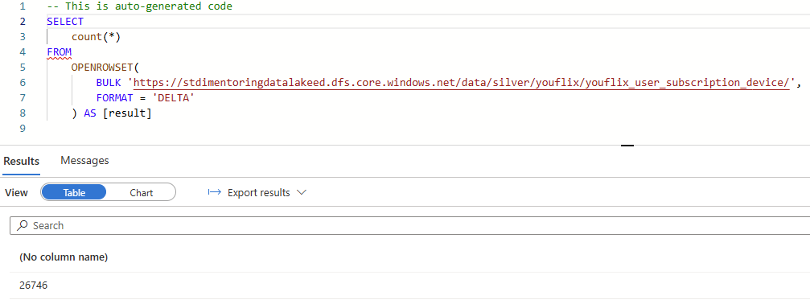

# Task 1.2 Databricks YouFlix DB Silver

## Run Scenario:

1. Before starting the run scenario, clear `bronze/youflix` and `silver/youflix` directories.
2. Delete and re-create YouFlixDB database from scratch using `DeploymentScript.sql` script. It is necessary to
   get rid of the results of your previous execution and testing activities.
3. Drop `YouFlix` database from your Databricks workspace.
4. Go to data lake `stdimentoringdatalakexx` and proceed to Storage browser, then click on Tables and edit
   each of entity by setting watermark value to `2000-01-01T00:00:00.00Z`.
5. Run pipeline from task 1.1.
6. Run the notebook `uc1_load_bronze_to_silver.ipynb`.
   
7. Create new notebook `test` in Azure Databricks.
8. Run `display(dbutils.fs.ls("/mnt/data/silver/youflix"))` in “test” notebook and take screenshot(s) of the
   results.
   

9. Run `display(dbutils.fs.ls("/mnt/data/silver/youflix/youflix_device"))` in “test” notebook and take
   screenshot(s) of the results.
    

10. Run `display(dbutils.fs.ls("/mnt/data/silver/youflix/youflix_subscription"))` in “test” notebook and take
    screenshot(s) of the results.
    

11. Run `display(dbutils.fs.ls("/mnt/data/silver/youflix/youflix_user"))` in “test” notebook and take screenshot(s)
    of the results.
12. Run `display(dbutils.fs.ls("/mnt/data/silver/youflix/youflix_user_subscription_device"))` in “test” notebook
    and take screenshot(s) of the results.
    

13. In Synapse Workspace, navigate to Data section, find in Linked tab your container, open `silver/youflix` and
    check number of rows for each delta table using SQL query.
14. Take screenshot(s) of SQL queries in with count values.
    
    
    

15. Connect to MS SQL Server YouFlixDB database and run the following command:
    ```sql
    EXEC youflix_internal.sp_youflix_tables_insert_update 10000, 15;
    ```
    
    
16. Run pipeline from task 1.1.
17. Run the notebook `uc1_load_bronze_to_silver.ipynb`.
18. In Synapse Workspace, navigate to Data section, find in Linked tab your container, open “bronze/youflix”
    and check number of rows for each newly loaded file using SQL query.
19. Take screenshot(s) of SQL queries with count values.
    


## Full Notebook:

```python
# Authenticate Databricks to access Data Lake
# <scope name> value must be updated with Azure Key Vault-backed secret scope name
# <app-id-azure-key-vault-key> must be updated with Azure Key Vault value for application id
# <tenant-id-azure-key-vault-key> must be updated with Azure Key Vault value for tenant id
# <client-secret-azure-key-vault-key> must be updated with Azure Key Vault value for client secret

AppID = dbutils.secrets.get(scope="secret-scope-ed", key="applicationID>")
TenantID = dbutils.secrets.get(scope="secret-scope-ed", key="tenantID")
ClientSecret = dbutils.secrets.get(scope="secret-scope-ed", key="clientSecret")

configs = {"fs.azure.account.auth.type": "OAuth",
           "fs.azure.account.oauth.provider.type": "org.apache.hadoop.fs.azurebfs.oauth2.ClientCredsTokenProvider",
           "fs.azure.account.oauth2.client.id": AppID,
           "fs.azure.account.oauth2.client.secret": ClientSecret,
           "fs.azure.account.oauth2.client.endpoint": "https://login.microsoftonline.com/{tenant}/oauth2/token".format(
               tenant=TenantID)}

# Mounting data in an Azure storage account using an Azure Active Directory (Azure AD) application service principal for authentication
# dbutils.fs.unmount("/mnt/data") #use to unmount data if needed
# <data-lake-name> must be replaced with your Azure Data Lake Storage Gen2 name

try:
    dbutils.fs.mount(
        source="abfss://data@stdimentoringdatalakeed.dfs.core.windows.net/",
        mount_point="/mnt/data",
        extra_configs=configs)
except Exception as e:
    if "Directory already mounted" in str(e):
        pass  # Ignore error if already mounted.
    else:
        raise e
```

```python
dbutils.fs.mounts()
```

    [MountInfo(mountPoint='/databricks-datasets', source='databricks-datasets', encryptionType=''),
     MountInfo(mountPoint='/Volumes', source='UnityCatalogVolumes', encryptionType=''),
     MountInfo(mountPoint='/databricks/mlflow-tracking', source='databricks/mlflow-tracking', encryptionType=''),
     MountInfo(mountPoint='/databricks-results', source='databricks-results', encryptionType=''),
     MountInfo(mountPoint='/databricks/mlflow-registry', source='databricks/mlflow-registry', encryptionType=''),
     MountInfo(mountPoint='/Volume', source='DbfsReserved', encryptionType=''),
     MountInfo(mountPoint='/volumes', source='DbfsReserved', encryptionType=''),
     MountInfo(mountPoint='/mnt/data', source='wasbs://data@stdimentoringdatalakeed.blob.core.windows.net/', encryptionType=''),
     MountInfo(mountPoint='/', source='DatabricksRoot', encryptionType=''),
     MountInfo(mountPoint='/volume', source='DbfsReserved', encryptionType='')]

```python
%sql
-- Creating
database and delta
tables if not exist

CREATE
DATABASE
IF
NOT
EXISTS
YouFlix;
CREATE
TABLE
IF
NOT
EXISTS
YouFlix.youflix_user_delta(
    user_id
BIGINT,
user_name
STRING,
user_email
STRING,
first_name
STRING,
last_name
STRING,
user_date_of_birth
DATE,
user_address
STRING,
user_phone
STRING,
created_timestamp
TIMESTAMP,
expiration_timestamp
TIMESTAMP,
modified_timestamp
TIMESTAMP
)
USING
DELTA
LOCATION
'/mnt/data/silver/youflix/youflix_user';

CREATE
TABLE
IF
NOT
EXISTS
YouFlix.youflix_device_delta(
    device_id
BIGINT,
device_name
STRING,
device_type
STRING,
device_os
STRING,
created_timestamp
TIMESTAMP
)
USING
DELTA
LOCATION
'/mnt/data/silver/youflix/youflix_device';

CREATE
TABLE
IF
NOT
EXISTS
YouFlix.youflix_subscription_delta(
    subscription_id
BIGINT,
subscription_name
STRING,
subscription_type
STRING,
subscription_video_quality
STRING,
subscription_max_devices
INT,
created_timestamp
TIMESTAMP,
expiration_timestamp
TIMESTAMP
)
USING
DELTA
LOCATION
'/mnt/data/silver/youflix/youflix_subscription';

CREATE
TABLE
IF
NOT
EXISTS
YouFlix.youflix_user_subscription_device_delta(
    user_subscription_device_id
BIGINT,
user_id
BIGINT,
device_id
BIGINT,
created_timestamp
TIMESTAMP
)
USING
DELTA
LOCATION
'/mnt/data/silver/youflix/youflix_user_subscription_device';

```

<style scoped>
  .table-result-container {
    max-height: 300px;
    overflow: auto;
  }
  table, th, td {
    border: 1px solid black;
    border-collapse: collapse;
  }
  th, td {
    padding: 5px;
  }
  th {
    text-align: left;
  }
</style><div class='table-result-container'><table class='table-result'><thead style='background-color: white'><tr></tr></thead><tbody></tbody></table></div>

```python
import re
from delta.tables import *
from pyspark.sql.functions import *
from pyspark.sql import Window

# dictionary "entities" store the name of the entities and it's BK 
entities = {"device": "device_id",
            "subscription": "subscription_id",
            "user": "user_id",
            "user_subscription_device": "user_subscription_device_id"}

try:
    # looping through every entity
    for entity in entities.items():

        bronzePath = "/mnt/data/bronze/youflix/youflix_{entity_name}".format(entity_name=entity[0])
        silverPath = "/mnt/data/silver/youflix/youflix_{entity_name}".format(entity_name=entity[0])
        processedPath = "/mnt/data/bronze/youflix/processed/youflix_{entity_name}".format(entity_name=entity[0])

        # files to load from bronze to silver
        filePaths = dbutils.fs.ls(bronzePath)

        if filePaths:

            # MERGE BRONZE TO SILVER

            # TODO
            # use pyspark spark.read.load method to create dataframe based on csv files in the bronzePath
            # do not forget that file has header

            bronzeDF = spark.read.option("header", "true").option("inferSchema", "true").csv(bronzePath)

            partition = Window.partitionBy(entity[1]).orderBy(col("filedate").desc())

            bronzeDF_cln = (bronzeDF.withColumn("filedate",
                                                to_timestamp(regexp_extract(input_file_name(), '([\d]{14})', 0),
                                                             'yyyyMMddhhmmss'))
                            .withColumn("rn", row_number().over(partition))
                            .filter("rn == 1")
                            )

            # get delta table at the silver path
            silver_table = DeltaTable.forPath(spark, silverPath)

            # TODO
            # add your code into brackets below
            # use pyspark merge method to merge bronzeDF_cln dataframe into silver_table by BK. BK for table can be accessible by entity[1]
            # refer to the https://learn.microsoft.com/en-us/azure/databricks/delta/merge to learn about upsert into a Delta Lake table using merge. 
            # this article https://docs.delta.io/latest/delta-update.html#table-deletes-updates-and-merges&language-python will help to understand how to delete, update and merge Delta tables
            (
                silver_table.alias('silver')
                .merge(
                    bronzeDF_cln.alias('updates'),
                    f'silver.{entity[1]} = updates.{entity[1]}'
                )
                .whenMatchedUpdate(
                    set=
                    {
                        col: f"updates.{col}" for col in bronzeDF.columns
                    }
                )
                .whenNotMatchedInsert(values=
                {
                    col: f"updates.{col}" for col in bronzeDF.columns
                }
                )
                .execute()
            )

            # MOVE TO PROCESSED DIRECTORY 

            # looping through every file in directory
            for file_info in filePaths:
                # creating tuple to store (year, month, day) of the file
                file_date = (re.split("_", file_info.name)[-1][0:4], re.split("_", file_info.name)[-1][4:6],
                             re.split("_", file_info.name)[-1][6:8])

                # TODO 
                # complete mv command to move files from bronzePath to processedPath according to the structure in 1.2.7.
                # use file_date tuple to get year, month and day of the file, use file_info.name to get name of file
                dbutils.fs.mv(file_info.path, processedPath + "/" + file_date[0] + "/" + file_date[1] + "/" + file_date[
                    2] + "/" + file_info.name)

            # REMOVE Success.csv

            # TODO 
            dbutils.fs.rm(f"/mnt/data/bronze/youflix/Success_{entity[0]}.txt")

        else:
            print("Entity \"{entity}\" - No files for load".format(entity=entity[0]))

except Exception as e:
    print(e)

```
