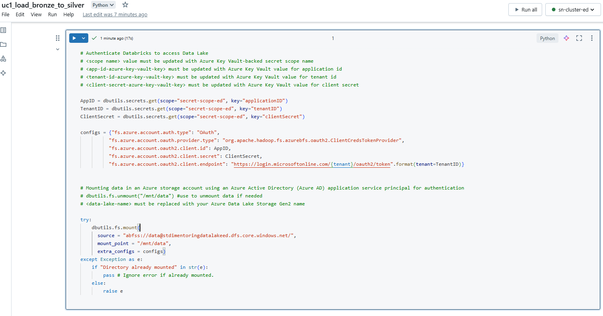

# Task 1.2 Databricks YouFlix DB Silver

## Prerequisites:

1. Create Azure AAD application and service principal `app-reg-di-mentoring-xx` (`xx` – your initials).

   • Supported account types – Accounts in this organizational directory only (EPAM only - Single tenant).
   

2. Create new client secret for your `app-reg-di-mentoring-xx`. Security requirement:

   • Store service principal’s Application ID, Tenant ID and Client Secret value as a separate Azure Key Vault
   secrets.
   
   

3. Grant your service principal `app-reg-di-mentoring-xx` access to your data lake by assigning Storage Blob
   Data Contributor role.
   

4. Create Azure Key Vault-backed secret scope in Azure Databricks workspace.
   

5. In Azure Databricks workspace, create new cluster with the following settings:

   • Cluster type – Single node.
   • Access mode – No isolation shared.
   • Databricks runtime version – 13.0.
   • Terminate after – 15 minutes.
   

6. Download the notebook `uc1_load_bronze_to_silver.ipynb` by the link and import it to Databricks
   workspace.
   IMPORTANT: in the current task, you do not need to create Unity Catalog.
   

7. In `Cmd 1` block, fill in your values for parameters in `<>` brackets.
   

8. In `Cmd 2` block, write your code to create YouFlix Database (Schema) using SQL.
9. In `Cmd 2` block, add SQL code to create unmanaged Delta Lake tables in YouFlix Database (Schema)
   according to the schema:

   • YouFlix.youflix_user_delta.
   • YouFlix.youflix_device_delta.
   • YouFlix.youflix_subscription_delta.
   • YouFlix.youflix_user_subscription_device_delta.

   In the step, use Delta data source and your mounted data lake storage.
   

10. In `Cmd 3` block, complete TODO block in #MERGE BRONZE TO SILVER part of code to load files from
    bronze directory to Delta Lakes tables. Tables should be merged by their keys.
    Refer to the link to learn about upsert into a Delta Lake table using merge. This link will help to understand
    how to delete, update and merge Delta tables
11. In `Cmd 3` block, complete TODO block in #MOVE TO PROCESSED DIRECTORY part of code to move files
    from bronze layer to processed directory after successful load. The following structure should be used:
    ```commandline
    data
    ├─bronze
    │ └─youflix
    │ └─processed
    │ ├─youflix_user
    │ │ └─yyyy
    │ │ └─mm
    │ │ └─dd
    │ │ └─youflix_user_yyyyMMddHHmmss.csv
    │ ├─youflix_device
    │ │ └─yyyy
    │ │ └─mm
    │ │ └─dd
    │ │ └─youflix_device_yyyyMMddHHmmss.csv
    │ ├─ youflix_subscription
    ...
    ```
    Refer to the link to learn about Databricks Utilities (dbutils) and its mv and rm commands.
12. In “Cmd 3” block, complete TODO block #REMOVE Success.csv in part to remove Success.csv file after
    successful load.


```sql
%sql
-- Creating database and delta tables if not exist

CREATE DATABASE IF NOT EXISTS YouFlix;
CREATE TABLE IF NOT EXISTS YouFlix.youflix_user_delta (
    user_id BIGINT,
    user_name STRING,
    user_email STRING,
    first_name STRING,
    last_name STRING,
    user_date_of_birth DATE,
    user_address STRING,
    user_phone STRING,
    created_timestamp TIMESTAMP,
    expiration_timestamp TIMESTAMP,
    modified_timestamp TIMESTAMP
)
USING DELTA
LOCATION '/mnt/data/silver/youflix/youflix_user';
CREATE TABLE IF NOT EXISTS YouFlix.youflix_device_delta (
    device_id BIGINT,
    device_name STRING,
    device_type STRING,
    device_os STRING,
    created_timestamp TIMESTAMP
)
USING DELTA 
LOCATION '/mnt/data/silver/youflix/youflix_device';
CREATE TABLE IF NOT EXISTS YouFlix.youflix_subscription_delta (
    subscription_id BIGINT,
    subscription_name STRING,
    subscription_type STRING,
    subscription_video_quality STRING,
    subscription_max_devices INT,
    created_timestamp TIMESTAMP,
    expiration_timestamp TIMESTAMP
)
USING DELTA
LOCATION '/mnt/data/silver/youflix/youflix_subscription';

CREATE TABLE IF NOT EXISTS YouFlix.youflix_user_subscription_device_delta (
    user_subscription_device_id BIGINT,
    user_id BIGINT,
    device_id BIGINT,
    created_timestamp TIMESTAMP
)
USING DELTA
LOCATION '/mnt/data/silver/youflix/youflix_user_subscription_device';
```