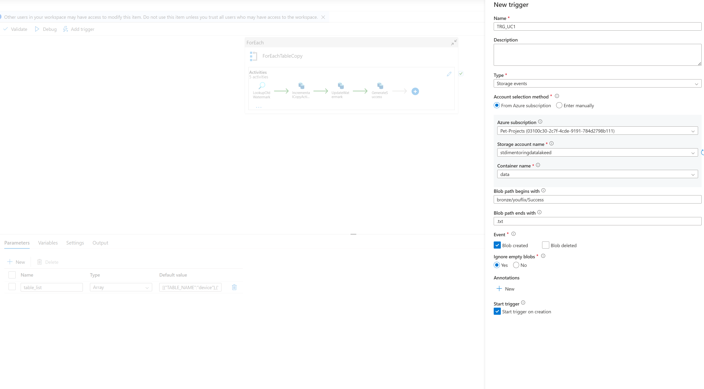
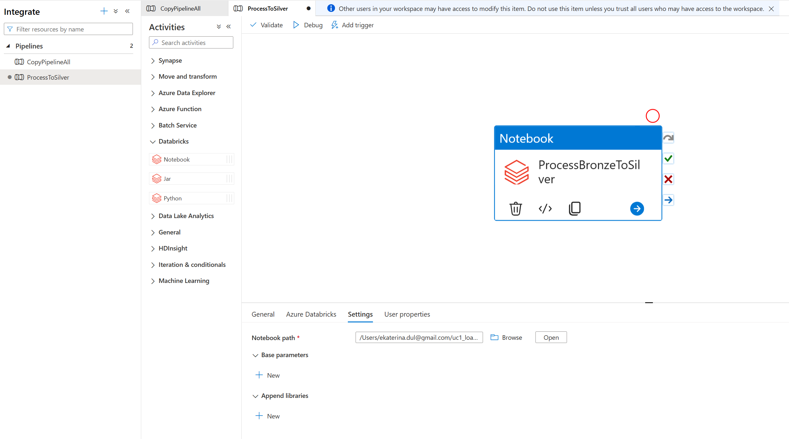
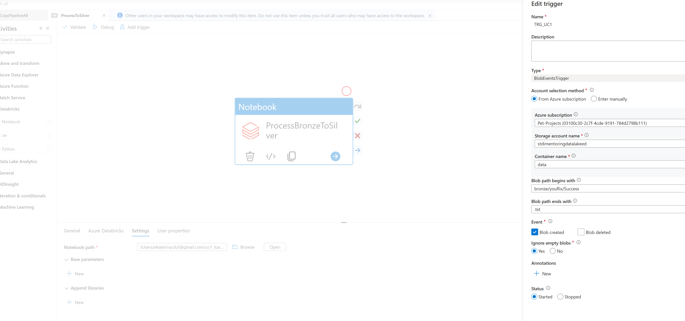
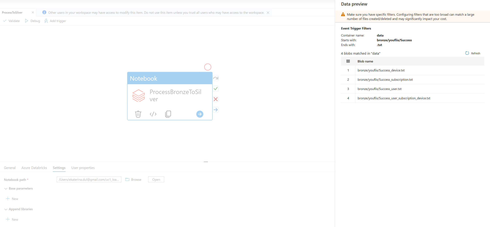

# Task 1.3 Orchestration with Storage Event Trigger

## Steps to complete the task:

1. In Azure Synapse Studio, create storage event trigger `TRG_UC1` with the following settings:
   • Blob path begins with – full path to `Success.csv`.
   • Event – Blob created.
   • Ignore empty blobs – Yes.
   

2. In Azure Synapse Studio, create Azure Databricks linked service. Security requirements:
   • Select cluster – Existing interactive cluster.
   • Authentication type – Managed service identity (refer to the link).
   • Existing cluster ID – your cluster ID.
   

3. Create a pipeline and add Notebook activity to execute Azure Databricks runbook created in previous task.
   

4. Link your new pipeline with `TRG_UC1` trigger.
   
   
