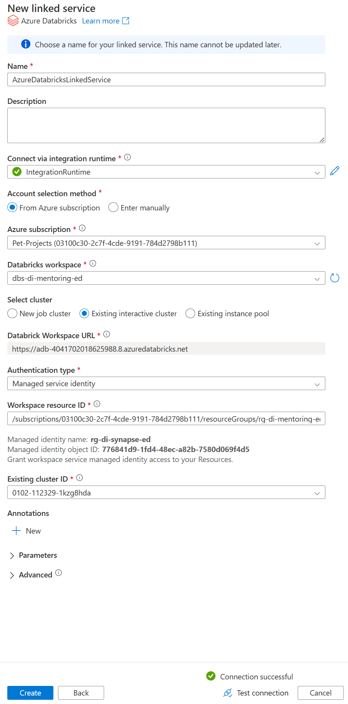

# Task 1.3 Orchestration with Storage Event Trigger

## Run Scenario:

1. Before starting the run scenario, clear `“bronze/youflix”` and `“silver/youflix”` directories.
2. Delete and re-create YouFlixDB database from scratch using `DeploymentScript.sql` script. It is necessary to
   get rid of the results of your previous execution and testing activities.
3. Drop `YouFlix` database from your Databricks workspace.
4. Go to data lake `stdimentoringdatalakexx` and proceed to Storage browser, then click on Tables and edit
   each of entity by setting watermark value to `2000-01-01T00:00:00.00Z`.
5. Take screenshot(s) of created trigger.
   

6. Execute pipeline from task 1.1 manually.
7. When it’s completed and pipeline from task 1.2 is triggered, take screenshot(s) from Monitor tab with
   `“Triggered by”` column is visible for the triggered pipeline.

8. In Synapse Workspace, navigate to Data section, find in Linked tab your container, open `“silver/youflix”` and
   check number of rows for each delta table using SQL query:

- youflix_device – 30
- youflix_subscription – 3
- youflix_user – 10000
- youflix_user_subscription_device – 26746

9. Take screenshot(s) of SQL queries with count values.
10. Connect to MS SQL Server YouFlix database and run the following command:
    ```sql
    EXEC youflix_internal.sp_youflix_tables_insert_update 200000, 0;
    ```
    
11. Execute pipeline from task 1.1 manually and wait until triggered pipeline from 1.2 is finished.
12. In Synapse Workspace, navigate to Data section, find in Linked tab your container, open “silver/youflix” and
    check number of rows for each delta table using SQL query:

- youflix_device – 30
- youflix_subscription – 3
- youflix_user – 200000
- youflix_user_subscription_device – 531173

13. Take screenshot(s) of SQL queries with count values.

## Steps to complete the task:

1. In Azure Synapse Studio, create storage event trigger `TRG_UC1` with the following settings:
   • Blob path begins with – full path to `Success.csv`.
   • Event – Blob created.
   • Ignore empty blobs – Yes.
   

2. In Azure Synapse Studio, create Azure Databricks linked service. Security requirements:
   • Select cluster – Existing interactive cluster.
   • Authentication type – Managed service identity (refer to the link).
   • Existing cluster ID – your cluster ID.
   

3. Create a pipeline and add Notebook activity to execute Azure Databricks runbook created in previous task.
   

4. Link your new pipeline with `TRG_UC1` trigger.
   
   
