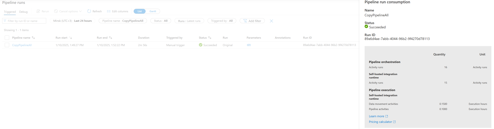
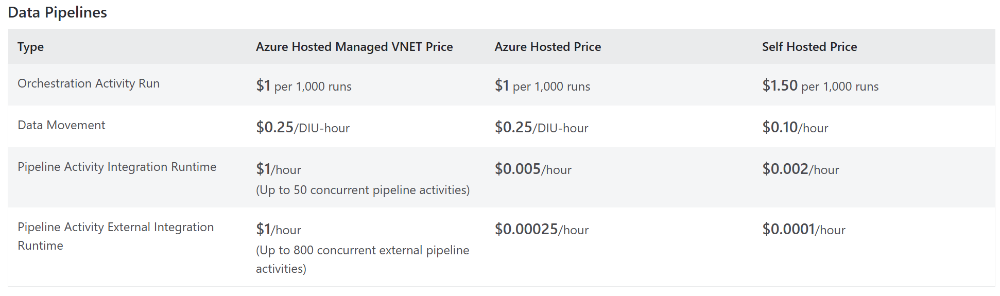
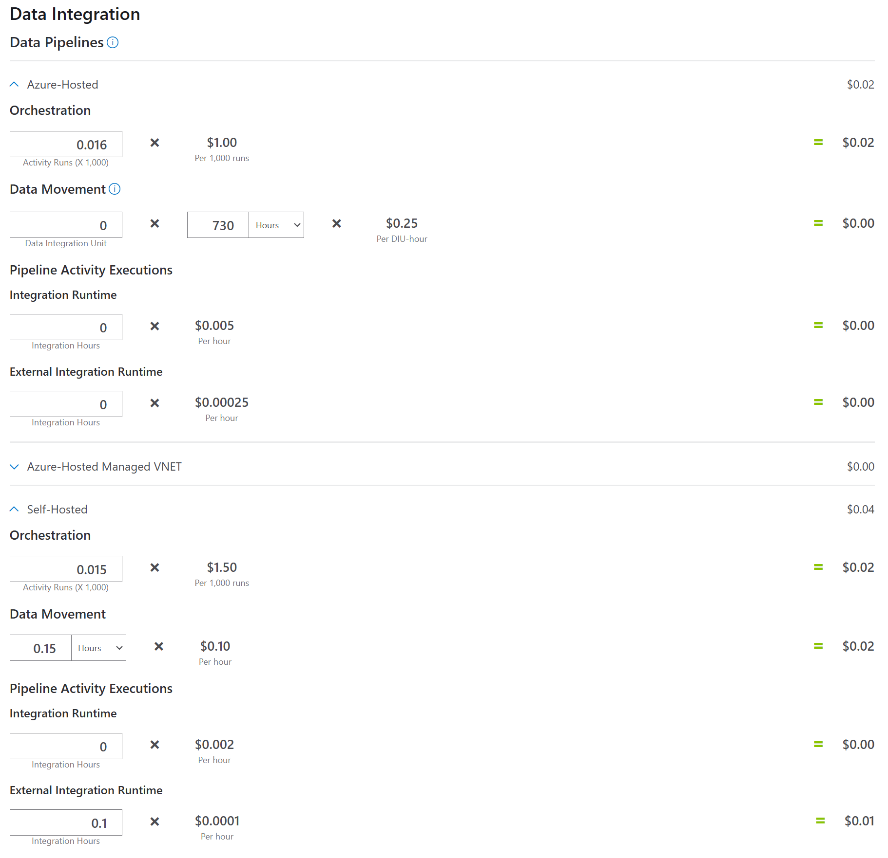
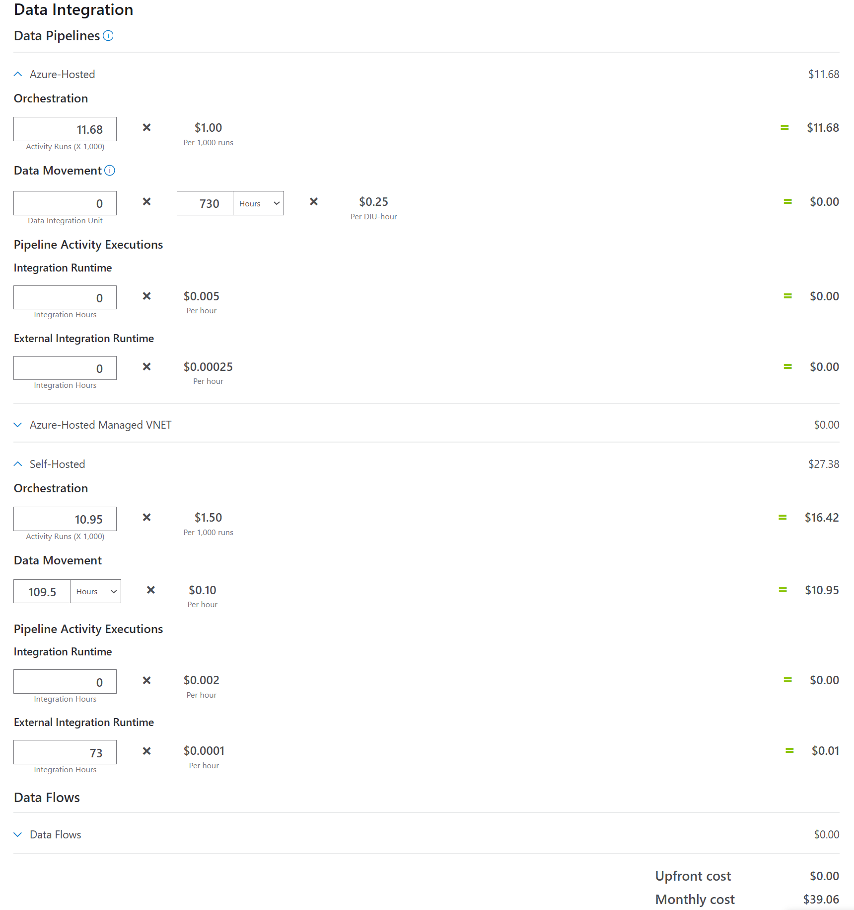
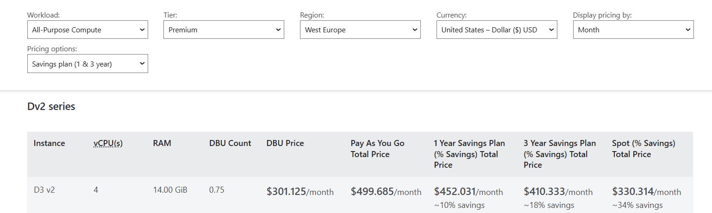
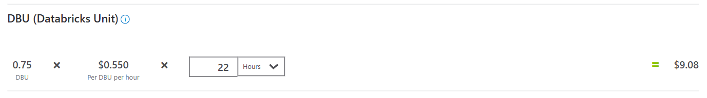

# Task 1.4 Cost Analysis

## Steps to complete the task

1. Analyze resources consumed by your pipeline in the Task 1.1. Refer to the Monitor, navigate to pipeline
   execution and click Consumption icon.
2. Take a screenshot of the Pipeline run consumption report.
   

   <table role="table" class="p-datatable-table ng-star-inserted" id="pr_id_14-table"><!----><thead class="p-datatable-thead"><tr _ngcontent-ng-c1635484556="" class="ng-star-inserted"><th _ngcontent-ng-c1635484556="" tabindex="0" class="textColumn ng-star-inserted" aria-label="">

</th><th _ngcontent-ng-c1635484556="" tabindex="0" class="textColumn ng-star-inserted" aria-label="Quantity">
Quantity
</th><th _ngcontent-ng-c1635484556="" tabindex="0" class="textColumn ng-star-inserted" aria-label="Unit">
Unit
</th><!----></tr><!----></thead><!----><tbody class="p-element p-datatable-tbody"><!----><tr _ngcontent-ng-c1635484556="" class="p-element p-selectable-row ng-star-inserted" tabindex="0"><td _ngcontent-ng-c1635484556="" class="ng-star-inserted">

Pipeline orchestration
<!---->
<!----><!----><!----><!----><!----><!----><!----></td><td _ngcontent-ng-c1635484556="" class="valueCell ng-star-inserted"><!----><!----><!----><!----></td><td _ngcontent-ng-c1635484556="" class="valueCell ng-star-inserted"><!----><!----><!----><!----></td><!----></tr><!----><!----><!----><!----><!----><!----><tr _ngcontent-ng-c1635484556="" class="p-element p-selectable-row ng-star-inserted" tabindex="0"><td _ngcontent-ng-c1635484556="" class="ng-star-inserted"><!----><!---->
 Activity runs 
<!----><!----><!----><!----><!----></td><td _ngcontent-ng-c1635484556="" class="valueCell ng-star-inserted">
 16 
<!----><!----><!----><!----></td><td _ngcontent-ng-c1635484556="" class="valueCell ng-star-inserted">
 Activity runs 
<!----><!----><!----><!----></td><!----></tr><!----><!----><!----><!----><!----><!----><tr _ngcontent-ng-c1635484556="" class="p-element p-selectable-row ng-star-inserted" tabindex="0"><td _ngcontent-ng-c1635484556="" class="ng-star-inserted"><!----><!----><!----><!----><!----><!----><!----></td><td _ngcontent-ng-c1635484556="" class="valueCell ng-star-inserted"><!----><!----><!----><!----></td><td _ngcontent-ng-c1635484556="" class="valueCell ng-star-inserted"><!----><!----><!----><!----></td><!----></tr><!----><!----><!----><!----><!----><!----><tr _ngcontent-ng-c1635484556="" class="p-element p-selectable-row ng-star-inserted" tabindex="0"><td _ngcontent-ng-c1635484556="" class="ng-star-inserted"><!---->
 Self-hosted integration runtime 
<!----><!----><!----><!----><!----><!----></td><td _ngcontent-ng-c1635484556="" class="valueCell ng-star-inserted"><!----><!----><!----><!----></td><td _ngcontent-ng-c1635484556="" class="valueCell ng-star-inserted"><!----><!----><!----><!----></td><!----></tr><!----><!----><!----><!----><!----><!----><tr _ngcontent-ng-c1635484556="" class="p-element p-selectable-row ng-star-inserted" tabindex="0"><td _ngcontent-ng-c1635484556="" class="ng-star-inserted"><!----><!---->
 Activity runs 
<!----><!----><!----><!----><!----></td><td _ngcontent-ng-c1635484556="" class="valueCell ng-star-inserted">
 15 
<!----><!----><!----><!----></td><td _ngcontent-ng-c1635484556="" class="valueCell ng-star-inserted">
 Activity runs 
<!----><!----><!----><!----></td><!----></tr><!----><!----><!----><!----><!----><!----><tr _ngcontent-ng-c1635484556="" class="p-element p-selectable-row ng-star-inserted" tabindex="0"><td _ngcontent-ng-c1635484556="" class="ng-star-inserted"><!----><!----><!----><!----><!----><!----><!----></td><td _ngcontent-ng-c1635484556="" class="valueCell ng-star-inserted"><!----><!----><!----><!----></td><td _ngcontent-ng-c1635484556="" class="valueCell ng-star-inserted"><!----><!----><!----><!----></td><!----></tr><!----><!----><!----><!----><!----><!----><tr _ngcontent-ng-c1635484556="" class="p-element p-selectable-row ng-star-inserted" tabindex="0"><td _ngcontent-ng-c1635484556="" class="ng-star-inserted">

Pipeline execution
<!---->
<!----><!----><!----><!----><!----><!----><!----></td><td _ngcontent-ng-c1635484556="" class="valueCell ng-star-inserted"><!----><!----><!----><!----></td><td _ngcontent-ng-c1635484556="" class="valueCell ng-star-inserted"><!----><!----><!----><!----></td><!----></tr><!----><!----><!----><!----><!----><!----><tr _ngcontent-ng-c1635484556="" class="p-element p-selectable-row ng-star-inserted" tabindex="0"><td _ngcontent-ng-c1635484556="" class="ng-star-inserted"><!---->
 Self-hosted integration runtime 
<!----><!----><!----><!----><!----><!----></td><td _ngcontent-ng-c1635484556="" class="valueCell ng-star-inserted"><!----><!----><!----><!----></td><td _ngcontent-ng-c1635484556="" class="valueCell ng-star-inserted"><!----><!----><!----><!----></td><!----></tr><!----><!----><!----><!----><!----><!----><tr _ngcontent-ng-c1635484556="" class="p-element p-selectable-row ng-star-inserted" tabindex="0"><td _ngcontent-ng-c1635484556="" class="ng-star-inserted"><!----><!---->
 Data movement activities 
<!----><!----><!----><!----><!----></td><td _ngcontent-ng-c1635484556="" class="valueCell ng-star-inserted">
 0.1500 
<!----><!----><!----><!----></td><td _ngcontent-ng-c1635484556="" class="valueCell ng-star-inserted">
 Execution hours 
<!----><!----><!----><!----></td><!----></tr><!----><!----><!----><!----><!----><!----><tr _ngcontent-ng-c1635484556="" class="p-element p-selectable-row ng-star-inserted" tabindex="0"><td _ngcontent-ng-c1635484556="" class="ng-star-inserted"><!----><!---->
 Pipeline activities 
<!----><!----><!----><!----><!----></td><td _ngcontent-ng-c1635484556="" class="valueCell ng-star-inserted">
 0.1000 
<!----><!----><!----><!----></td><td _ngcontent-ng-c1635484556="" class="valueCell ng-star-inserted">
 Execution hours 
<!----><!----><!----><!----></td><!----></tr><!----><!----><!----><!----><!----><!----><tr _ngcontent-ng-c1635484556="" class="p-element p-selectable-row ng-star-inserted" tabindex="0"><td _ngcontent-ng-c1635484556="" class="ng-star-inserted"><!----><!----><!----><!----><!----><!----><!----></td><td _ngcontent-ng-c1635484556="" class="valueCell ng-star-inserted"><!----><!----><!----><!----></td><td _ngcontent-ng-c1635484556="" class="valueCell ng-star-inserted"><!----><!----><!----><!----></td><!----></tr><!----><!----><!----><!----><!----><!----><tr _ngcontent-ng-c1635484556="" class="p-element p-selectable-row ng-star-inserted" tabindex="0"><td _ngcontent-ng-c1635484556="" class="ng-star-inserted">

<!---->
<!----><!----><!---->

Learn more

<!----><!----><!----><!----></td><td _ngcontent-ng-c1635484556="" class="valueCell ng-star-inserted"><!----><!----><!----><!----></td><td _ngcontent-ng-c1635484556="" class="valueCell ng-star-inserted"><!----><!----><!----><!----></td><!----></tr><!----><!----><!----><!----><!----><!----><tr _ngcontent-ng-c1635484556="" class="p-element p-selectable-row ng-star-inserted" tabindex="0"><td _ngcontent-ng-c1635484556="" class="ng-star-inserted">

<!---->
<!----><!----><!---->

Pricing calculator

<!----><!----><!----><!----></td><td _ngcontent-ng-c1635484556="" class="valueCell ng-star-inserted"><!----><!----><!----><!----></td><td _ngcontent-ng-c1635484556="" class="valueCell ng-star-inserted"><!----><!----><!----><!----></td><!----></tr><!----><!----><!----><!----><!----><!----><!----><!----><!----><!----><!----><!----><!----></tbody><!----></table>

3. Using the information from the consumption report calculate cost of single pipeline execution. Provide
   detailed calculations by activity types (Data movement, Pipeline and External) and Integration runtime
   types (Azure Integration Runtime and Self-Hosted Integration Runtime).
   
   

4. Calculate monthly cost with the following assumptions:
   • Pipeline is executed hourly.
   • Each pipeline execution consumes the same amount of resources.
   

5. Calculate monthly cost of Databricks cluster owning with the following assumptions:
  
   - The cluster works 24 / 7.
   - You use Pay-As-You-Go payment method.
   
   DBU count for instance `D3 v2` is 0.75 DBU.
   

   Pipeline with notebook `uc1_load_bronze_to_silver` runs hourly for ~2 minutes each run (~0.03 hours). 
   Therefore, ~22 hours / month.

   DBU monthly cost:
   
