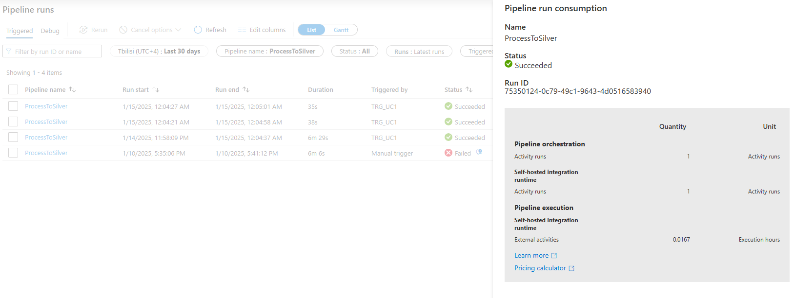

# Task 1.4 Cost Analysis

## Steps to complete the task

1. Analyze resources consumed by your pipeline in the Task 1.1. Refer to the Monitor, navigate to pipeline
   execution and click Consumption icon.
2. Take a screenshot of the Pipeline run consumption report.
   

3. Using the information from the consumption report calculate cost of single pipeline execution. Provide
   detailed calculations by activity types (Data movement, Pipeline and External) and Integration runtime
   types (Azure Integration Runtime and Self-Hosted Integration Runtime).
   
   

4. Calculate monthly cost with the following assumptions:
   - Pipeline is executed hourly.
   - Each pipeline execution consumes the same amount of resources.
   

5. Calculate cost of the second pipeline in the same way.
   

   **Table with final consumption costs**:
   <table>
   <tbody>
      <tr>
         <td>
            Activity Type
         </td>
         <td>
            Runtime
         </td>
         <td>
            Count
         </td>  
         <td>
            Pipeline
         </td>  
         <td>
            Base cost per unit
         </td>  
         <td>
            Single Execution Cost
         </td>  
         <td>
            Monthly Cost
         </td>     
      </tr>
      <tr>
         <td>
            Pipeline Orchestration (Activity Run)
         </td>
         <td>
            Azure
         </td>
         <td>
            16
         </td>  
         <td>
            CopyActivityAll
         </td>  
         <td>
            0.00
         </td>  
         <td>
            0.02
         </td>  
         <td>
            11.68
         </td>     
      </tr>
      <tr>
         <td>
            Pipeline Orchestration (Activity Run)
         </td>
         <td>
            Self-Hosted
         </td>
         <td>
            15
         </td>  
         <td>
            CopyActivityAll
         </td>  
         <td>
            0.00
         </td>  
         <td>
            0.02
         </td>  
         <td>
            16.42
         </td>     
      </tr>
      <tr>
         <td>
            Data Movement Activity (Execution Hours)
         </td>
         <td>
            Self-Hosted
         </td>
         <td>
            0.15
         </td>  
         <td>
            CopyActivityAll
         </td>  
         <td>
            0.10
         </td>  
         <td>
            0.02
         </td>  
         <td>
            10.95
         </td>     
      </tr>
      <tr>
         <td>
            Pipeline Activities
         </td>
         <td>
            Azure
         </td>
         <td>
            0.1
         </td>  
         <td>
            CopyActivityAll
         </td>  
         <td>
            0.01
         </td>  
         <td>
            0.00
         </td>  
         <td>
            0.06
         </td>     
      </tr>
      <tr>
         <td colspan="5"> 
            Total
         </td>
         <td> 0.06 </td>
         <td> 39.06 </td>
      </tr>
      <tr>
         <td>
            Pipeline Orchestration (Activity Run)
         </td>
         <td>
            Azure
         </td>
         <td>
            1
         </td>  
         <td>
            ProcessToSilver
         </td>  
         <td>
            0.00
         </td>  
         <td>
            0.00
         </td>  
         <td>
            0.73
         </td>     
      </tr>
      <tr>
         <td>
            Pipeline Orchestration (Activity Runs)
         </td>
         <td>
            Self-Hosted
         </td>
         <td>
            1
         </td>  
         <td>
            ProcessToSilver
         </td>  
         <td>
            0.00
         </td>  
         <td>
            0.00
         </td>  
         <td>
            0.00
         </td>     
      </tr>
      <tr>
         <td>
            Pipeline Execution
         </td>
         <td>
            Databricks
         </td>
         <td>
            0.0167
         </td>  
         <td>
            ProcessToSilver
         </td>  
         <td>
            0.41
         </td>  
         <td>
            0.012
         </td>  
         <td>
            9.08
         </td>     
      </tr>      
      <tr>
         <td colspan="5"> 
            Total
         </td>
         <td> 0.012 </td>
         <td> 9.81 </td>
      </tr>
   </tbody>
   </table>

5. Calculate monthly cost of Databricks cluster owning with the following assumptions:
   - The cluster works 24 / 7.
   - You use Pay-As-You-Go payment method.
   
   DBU count for instance `D3 v2` is 0.75 DBU.
   

   Pipeline with notebook `uc1_load_bronze_to_silver` runs hourly for ~2 minutes each run (~0.03 hours). 
   Therefore, ~22 hours / month.

   DBU monthly cost:
   
