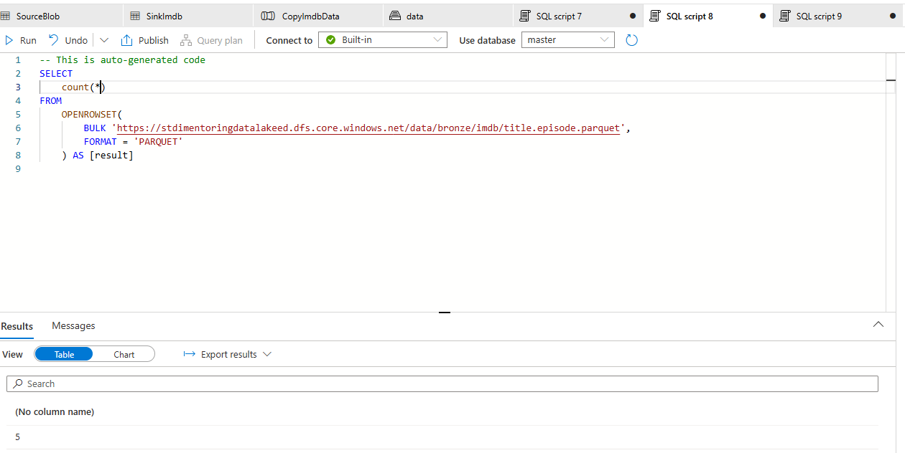

# Task 2.1 Synapse Pipeline with Copy Data Activity (IMDB Source)

## Run Scenario:

1. Take screenshot(s) of your pipeline.
   
   

2. Go to your created pipeline and execute it manually.
   

3. Once the job succeeds check “bronze/imdb” folder, it should contain three parquet files.
4. Take screenshot(s) of the target folder.
   

5. In Synapse Workspace, navigate to Data section, find in Linked tab your container, open “bronze/imdb” and
   check number of rows for each file using SQL query:

- `title.basics.parquet` – 13
- `title.episode.parquet` – 5
- `title.ratings.parquet` - 13

6. Take screenshot(s) of SQL queries in with count values.
   
   
   

