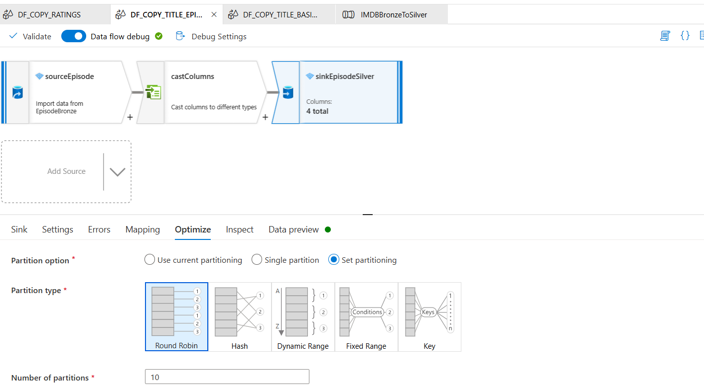
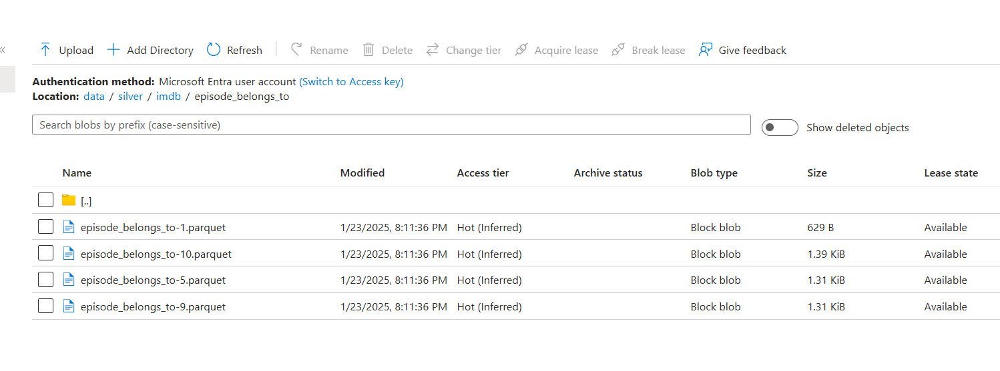
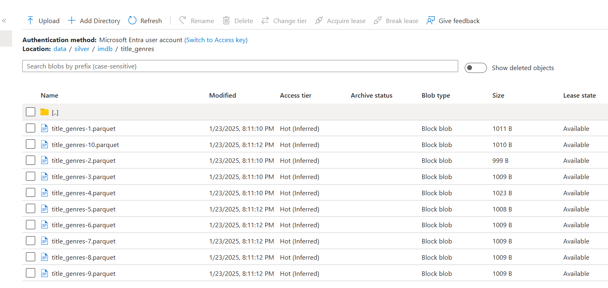
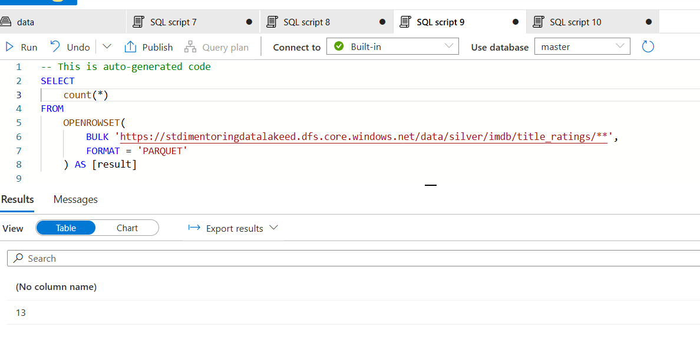

# Task 2.2 Synapse Pipeline with Data Flow Activity (IMDB Silver)

## Run Scenario:

1. Take screenshot(s) of your pipeline.
2. Take screenshot of each data flow to demonstrate used transformations.
 - Genre:

 - Rating:

 - Title:

 - Episode:

3. Go to your created pipeline and execute it manually.

4. Once the job succeeds check “silver/imdb” folder, it should contain four subfolders.
5. Take screenshots of the content of the “silver/imdb” folder and content of each subdirectory.

6. In Synapse Workspace, navigate to Data section, find in Linked tab your container, open “silver/imdb” and
   check number of rows for each subfolder using SQL query:

- `episode_belongs_to` – 5
- `title_genres` – 37
- `title_ratings` – 13
- `titles` – 13

7. Take screenshot(s) of SQL queries in with count values.

8. In Synapse Workspace, navigate to Data section, find in Linked tab your container, open “silver/imdb/” and
   get top 10 rows from “episode_belongs_to” entity. Take a screenshot with query results.

9. In Synapse Workspace, navigate to Data section, find in Linked tab your container, open “silver/imdb/” and
   get top 10 rows from “title_genres” entity. Take a screenshot with query results.

10. In Synapse Workspace, navigate to Data section, find in Linked tab your container, open “silver/imdb/” and
    get top 10 rows from “title_ratings” entity. Take a screenshot with query results.

11. In Synapse Workspace, navigate to Data section, find in Linked tab your container, open “silver/imdb/” and
    get top 10 rows from “titles” entity. Take a screenshot with query results.

12. In Synapse Workspace, write SQL queries to get the following:

- Number of rows per file in “silver/imdb/titles”
- Number of rows per file in “silver/imdb/episode_belongs_to”
- Number of rows per file in “silver/imdb/title_genres”
- Number of titles per file in “silver/imdb/title_ratings”

13. Take a screenshot with query results.

