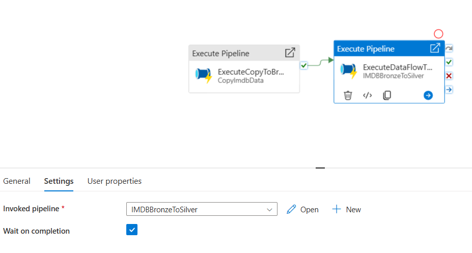

# Task 2.3 Orchestration with Schedule Trigger

## Run Scenario:

1. Take screenshot(s) of Master pipeline.

2. Go to your created master pipeline and execute it manually.
3. In Synapse Workspace, navigate to Data section and check count of rows in bronze and silver layers. The
   result should be the same as in task #2.1 and task #2.2.
4. Download from SharePoint folder a full version of source files and upload them to `[imdb]` container. They
   should replace existing files.

5. Go to your created master pipeline and execute it manually again.

6. Check number of rows for each file in “bronze/imdb”:

- `title.basics.parquet` – 9608554
- `title.episode.parquet` – 7279150
- `title.ratings.parquet` – 1278438

7. Take screenshot(s) of SQL queries in with count values.

8. Check number of rows for each subfolder in “silver/imdb”:

- `episode_belongs_to` – 7279150
- `title_genres` – 15306440
- `title_ratings` – 1278438
- `titles` – 9608554

9. Take screenshot(s) of SQL queries in with count values.

