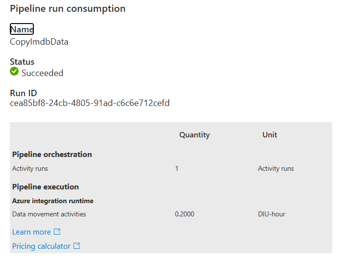
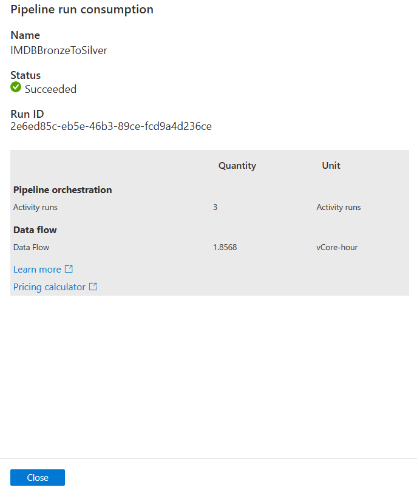

# Task 2.4 Cost Analysis

1. First pipeline consumption:

   

2. Second pipeline consumption:

   

3. Total cost (with assumption that pipelines executes *hourly*):

<table>
<tbody>
      <tr>
         <td>
            Activity Type
         </td>
         <td>
            Runtime
         </td>
         <td>
            Count
         </td>  
         <td>
            Pipeline
         </td>  
         <td>
            Base cost per unit
         </td>  
         <td>
            Single Execution Cost
         </td>  
         <td>
            Monthly Cost
         </td>     
      </tr>
      <tr>
         <td>
            Pipeline Orchestration (Activity Runs)
         </td>
         <td>
            Azure
         </td>
         <td>
            1
         </td>  
         <td>
            CopyImdbData
         </td>  
         <td>
            0.001
         </td>  
         <td>
            0.001
         </td>  
         <td>
            0.03
         </td>     
      </tr>
      <tr>
         <td>
            Data Movement Activities (DIU-hour)
         </td>
         <td>
            Azure
         </td>
         <td>
            0.2
         </td>  
         <td>
            CopyImdbData
         </td>  
         <td>
            0.25
         </td>  
         <td>
            0.0125
         </td>  
         <td>
            9.125
         </td>     
      </tr>  
      <tr>
         <td colspan="5">
         Total
         </td>
         <td>0.0135</td>
         <td>9.155</td>
      </tr>
      <tr>
         <td>
            Pipeline Orchestration (Activity Runs)
         </td>
         <td>
            Azure
         </td>
         <td>
            3
         </td>  
         <td>
            IMDBBronzeToSilver
         </td>  
         <td>
            0.001
         </td>  
         <td>
            0.003
         </td>  
         <td>
            0.09
         </td>     
      </tr>
      <tr>
         <td>
            Data Flow (vCore-hour)
         </td>
         <td>
            Azure
         </td>
         <td>
            1.8568
         </td>  
         <td>
            IMDBBronzeToSilver
         </td>  
         <td>
            0.257
         </td>  
         <td>
            0.477
         </td>  
         <td>
            348.21
         </td>     
      </tr>
      <tr>
         <td colspan="5">
         Total
         </td>
         <td>0.48</td>
         <td>348.3</td>
      </tr>
</tbody>
</table>