# Task 3.1 Azure Function (TMDB Bronze)

## Run Scenario:

1. Run the function locally with both of options as described here. Make sure that files are uploaded to the
   data lake folder.
   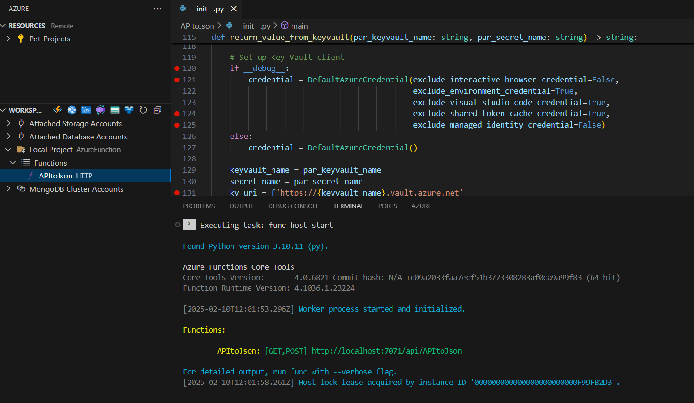
   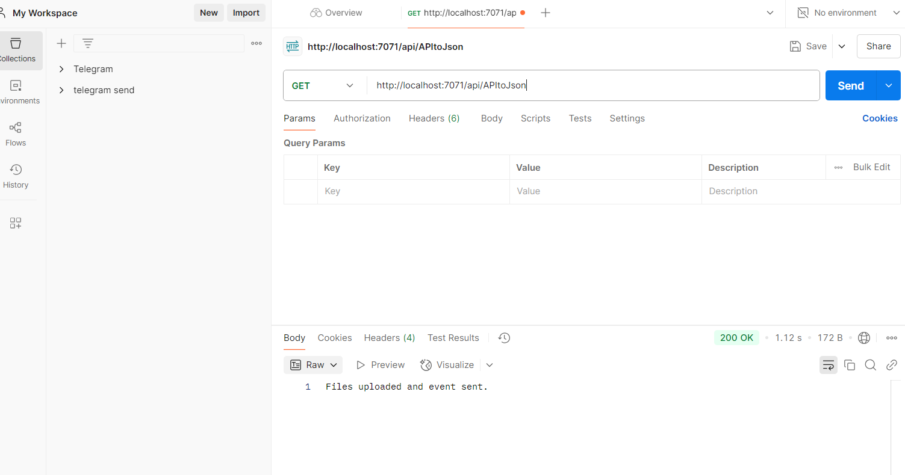
   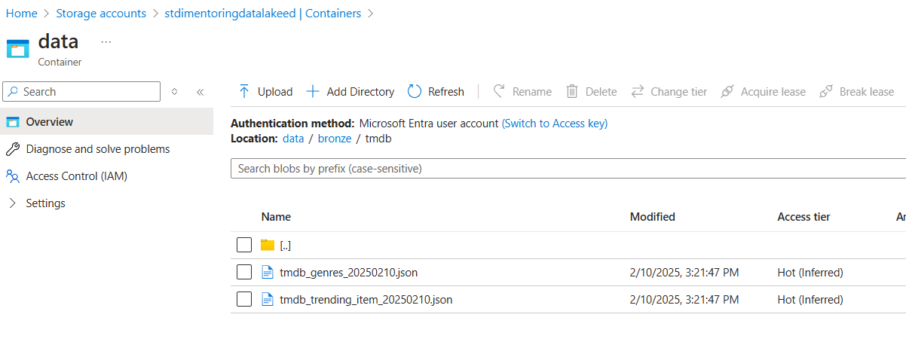

2. Take a screenshot of Postman GET request with message about successful file uploading.
   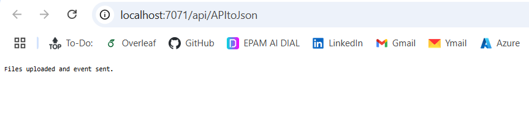

3. Navigate to Event Grid Topic Metrics menu, add Published Events metric to the chart. Take a screenshot of
   the chart with count of incoming events. There might be a small delay between sending event from
   function and reflecting published event in the chart.
   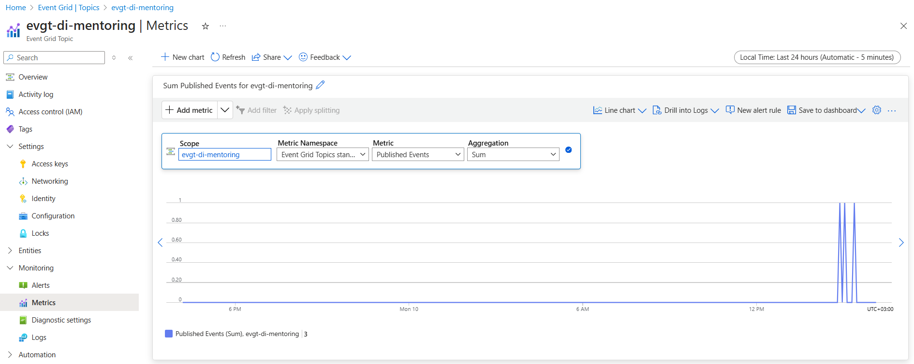

4. Deploy your function to Azure Function App according to the instructions.
5. Take a screenshot of message of the successful function deployment.
   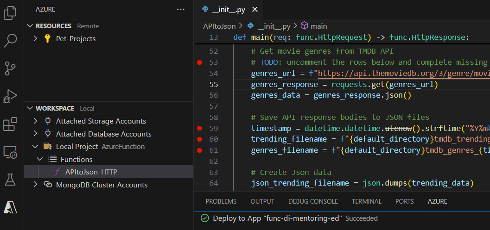

6. Navigate to your `func-di-mentoring-ed` function app in Azure portal, go to the Functions menu. Take a
   screenshot of functions list.
   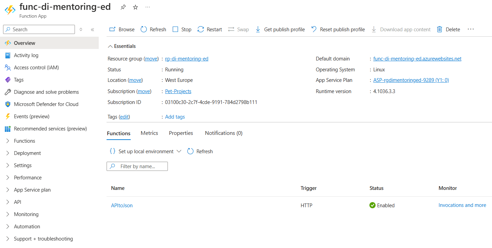

7. Run the function from Azure portal manually as described here.
8. Take a screenshot of HTTP response content area. Make sure that files are uploaded to the data lake folder
   and custom event is published to Event Grid Topic. There might be a small delay between sending event
   from function and reflecting published event in the chart.    
   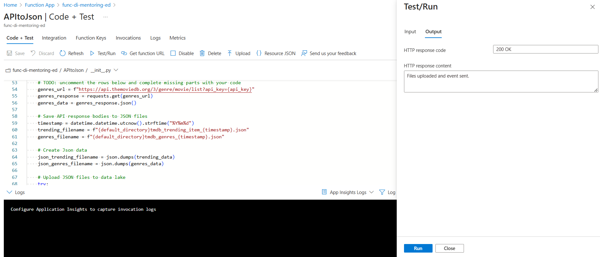

9. Run the function via Postman as described here.
10. Take a screenshot of HTTP response content area. Make sure that files are uploaded to the data lake folder
    and custom event is published to Event Grid Topic. There might be a small delay between sending event
    from function and reflecting published event in the chart.
    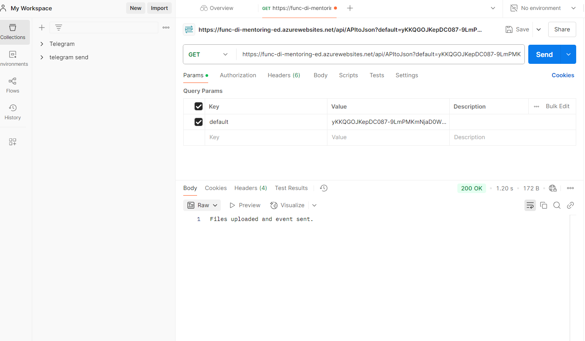

11. Take a screenshot of “bronze/tmdb” folder content.
    
    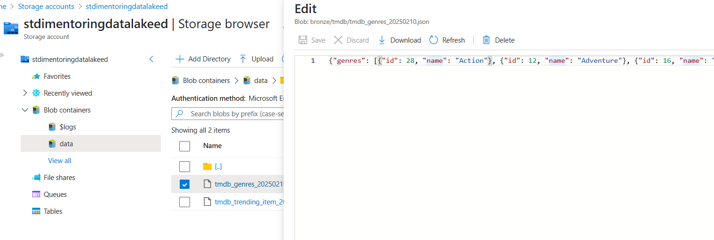
    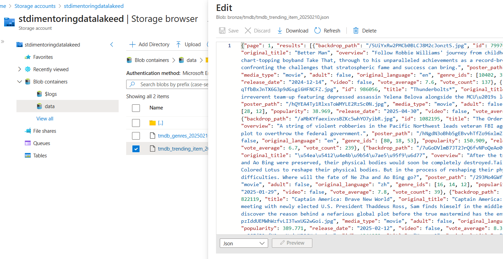
