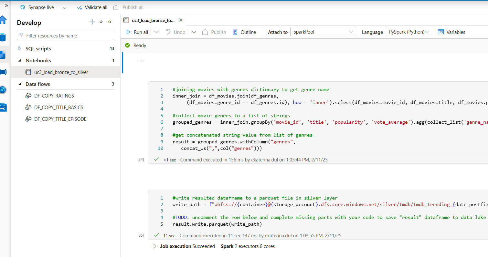
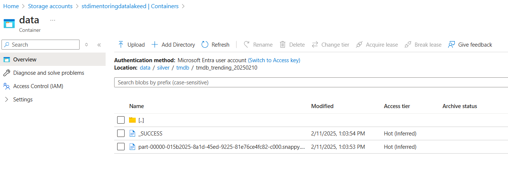
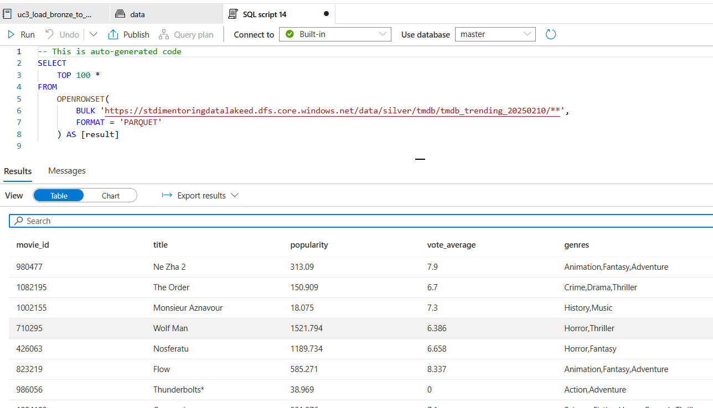

# Task 3.2 Synapse Spark Pool (TMDB Silver)

## Run Scenario:

1. To test your notebook and run it from Azure Synapse, assign real file paths to the parameters `in_file_genres`
   and `in_file_trending` like that:

```python
in_file_genres = "bronze/tmdb/tmdb_genres_20250210.json"
in_file_trending = "bronze/tmdb/tmdb_trending_item_20250210.json"
```

2. Run the notebook. Make sure that `tmdb_trending_YYYYMMDD` is created in silver layer.
   

3. Take a screenshot of “silver/tmdb” folder and content of `tmdb_trending_YYYYMMDD` subdirectory.
   

4. In Synapse Workspace, navigate to Data section, find in Linked tab your container, open “silver/tmdb/” and
   select all rows from `tmdb_trending_YYYYMMDD` subdirectory. Take a screenshot with query results.
   