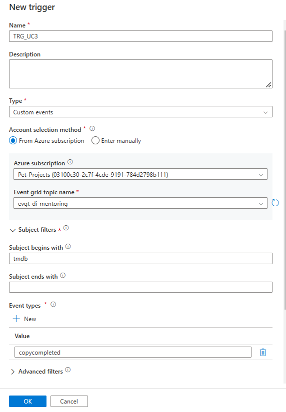
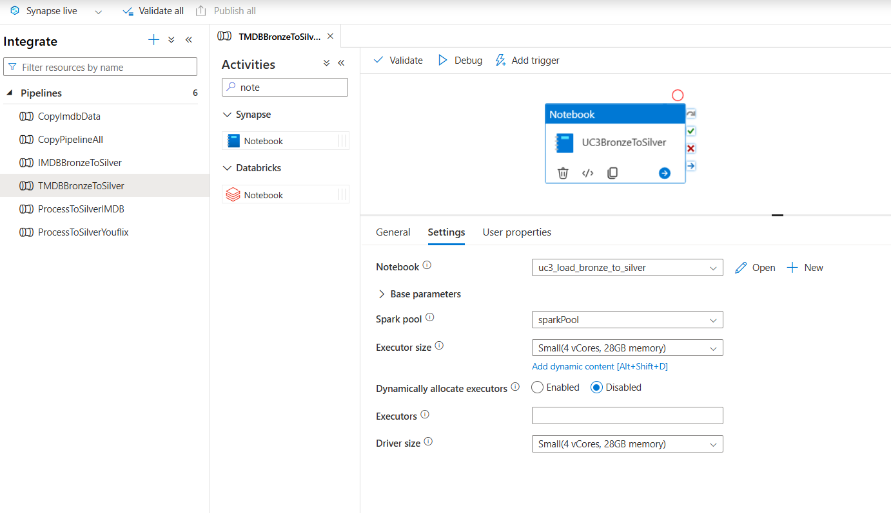
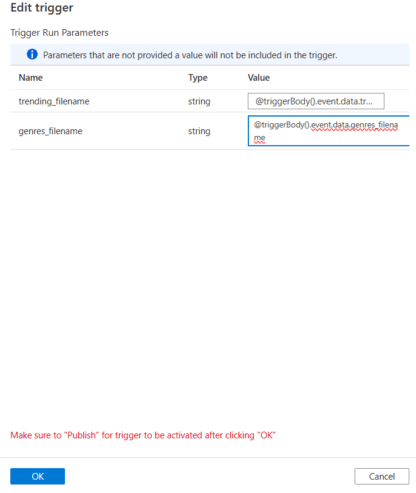
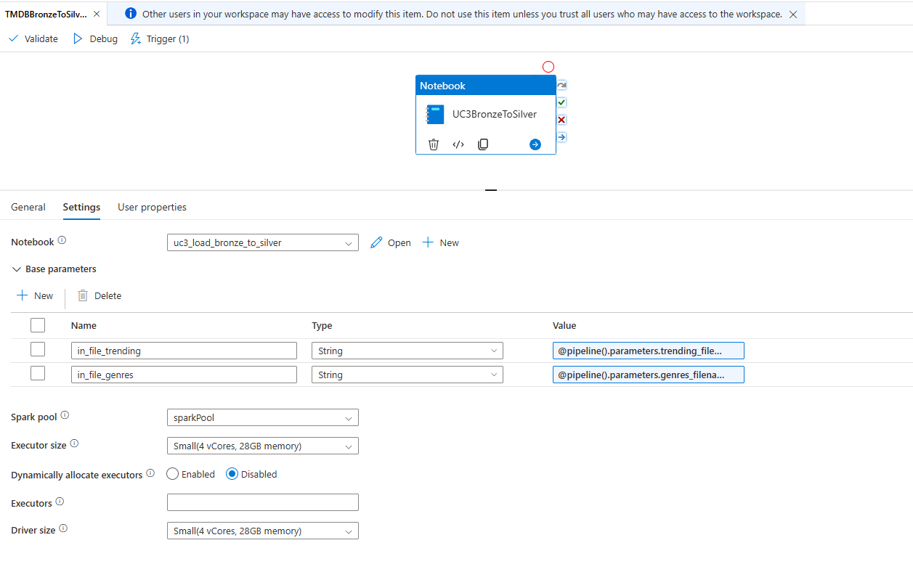
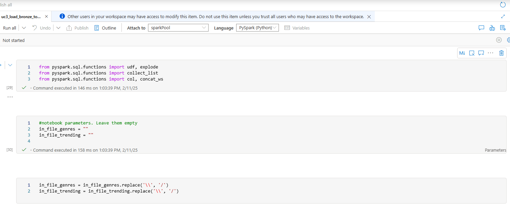
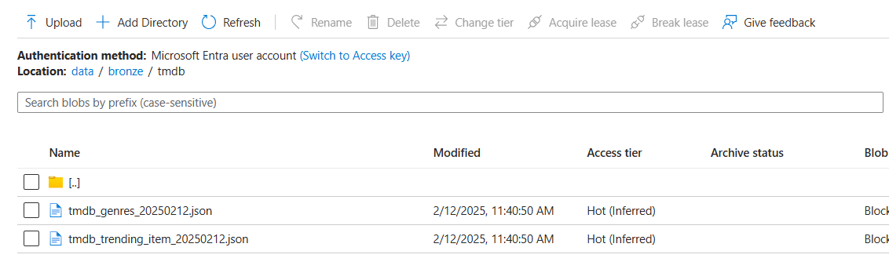
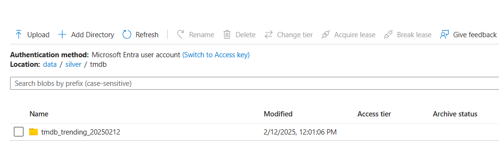
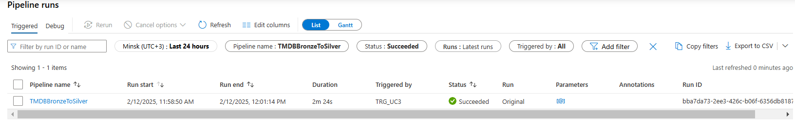

# Task 3.1 Orchestration with Custom Event Trigger

## Run Scenario:
1. Take a screenshot of your `TRG_UC3` trigger.

   

2. Take a screenshot of your pipeline. Pipeline parameters should be visible in the picture.
   
   

3. Take a screenshot of your Notebook activity settings with expanded Base parameters list.
   
   

4. Clear “bronze/tmdb” and “silver/tmdb” folders.
5. Run the function from Azure portal manually.
6. Make sure that files are uploaded to the data lake “bronze/tmdb” folder.
   

7. Make sure that `uc3_load_bronze_to_silver.ipynb` notebook finishes successfully, and new data uploaded
   to the data lake “silver/tmdb” folder.
   

8. Take a screenshot of pipeline runs Monitor with successful finished pipeline.
   