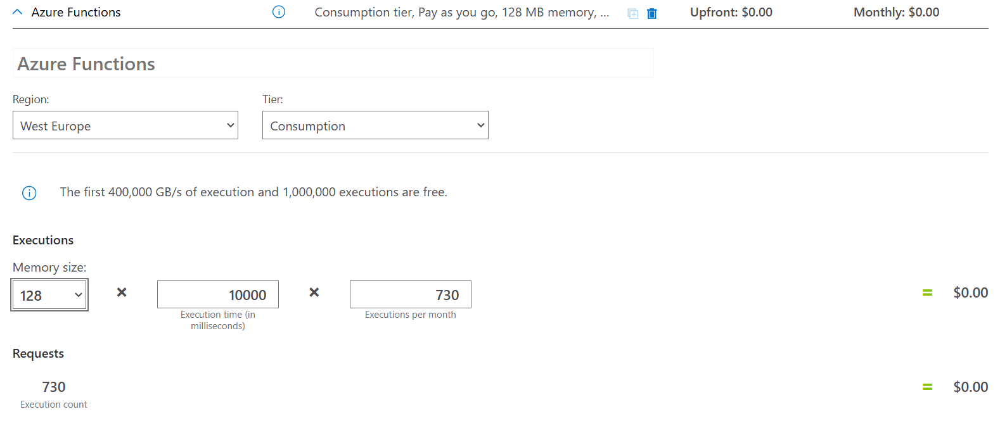

# Task 3.4 Cost Analysis

## Steps to complete the task:

1. Analyze Azure Functions pricing. In the task, function cost can be neglected.
   
   _Assuming that Azure Function is executed ~hourly (730 executions per month), and each run takes about 10 seconds,
   we can neglect function cost, since it is within free-limit._
   

2. Based on your Spark pool settings, calculate cost of processing TMDB data by the pool in the Task #3.2.

   - _Single execution cost of 3 small nodes (`0.62 $/hour = 0.155 $ vCore/hour * 4 vCores per node`) per one run (3 minutes start, 2 minutes processing time, and 10 minutes of IDLE time) will be:_
     ```
     3 nodes * 0.62 $ / hour * (3 + 2 + 10) / 60 hour  = 0.465 $.
     ``` 
3. Calculate monthly cost of Synapse Spark pool with the following assumptions:
   - TMDB processing is started daily.
   - Spark pool instantiation time is always the same – 3 min.
   - Notebook job runtime is always the same – 2 min.
   - IDLE time - 10 min.

   - _Total execution cost of 3 small nodes with job running daily will be:_
     ```
     3 nodes * 0.62 $ / hour * (3 + 2 + 10) / 60 hour * 30 days = 13.95 $.
     ``` 
   
