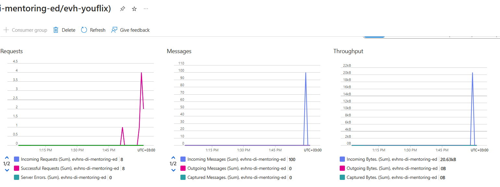

# Task 4.1 Event Hub

## Run Scenario:

1. Run “main.py” script.
   

2. Navigate to your `evh-youflix` event hub, click on Messages chart. The chart should display 100 incoming
   messages. There might be a delay between sending events from the script and reflecting them in the chart.
   

3. Take a screenshot of the chart displaying 100 incoming messages.
   
