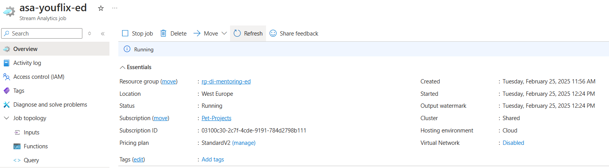
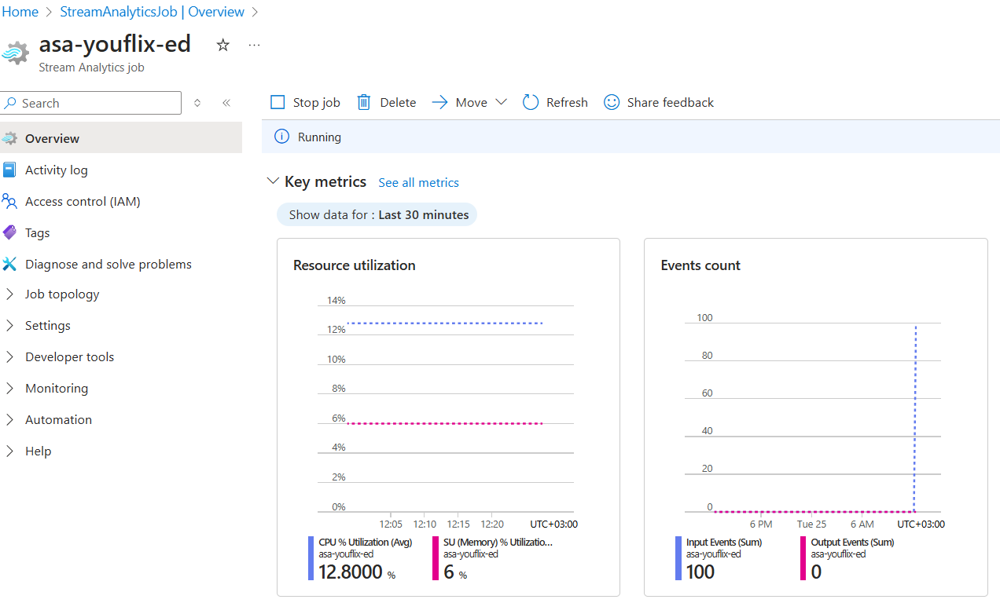
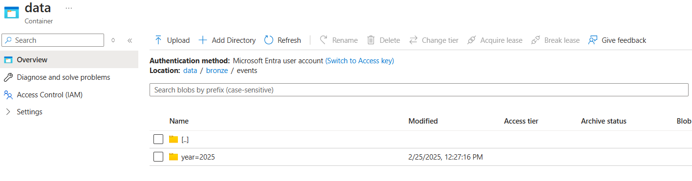
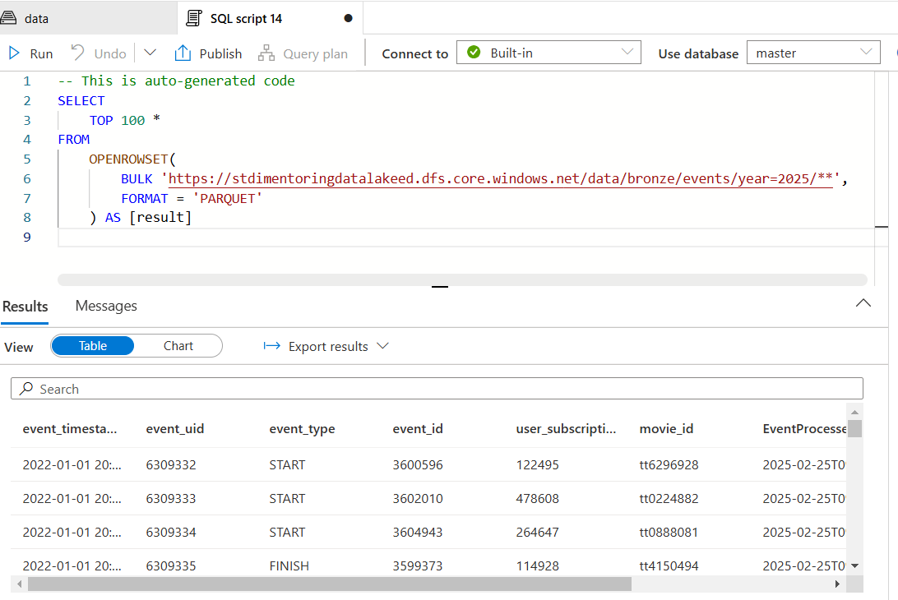
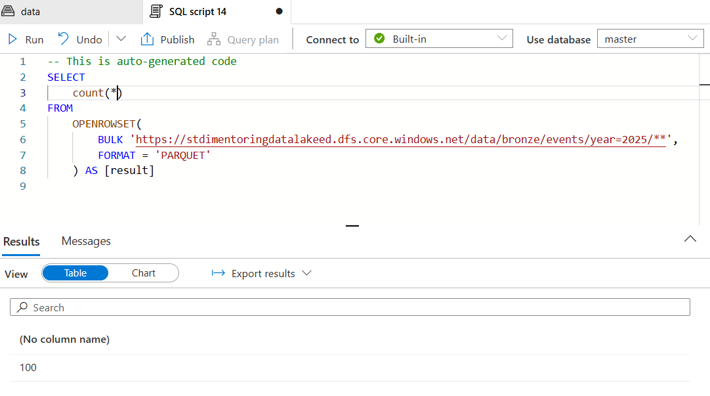
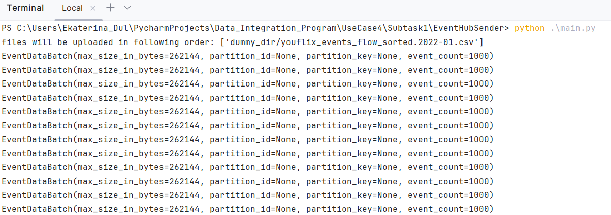
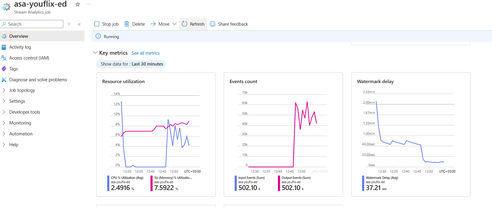
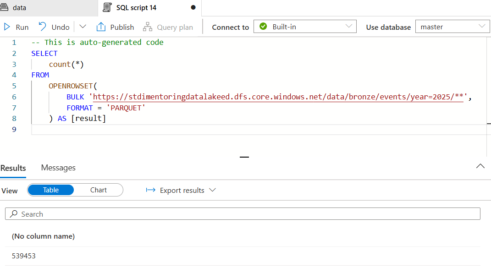
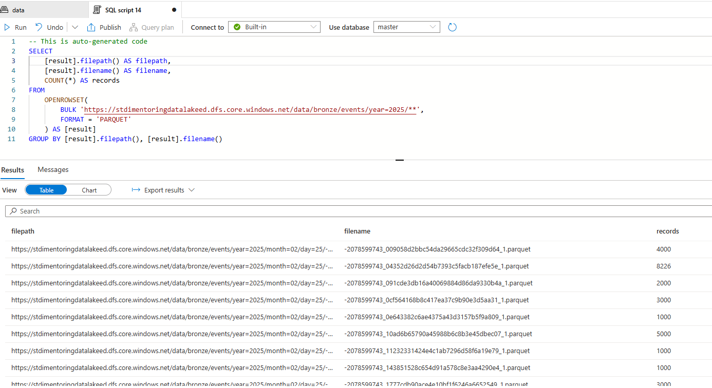

# Task 4.2  Stream Analytics Job (YouFlix Events Bronze)

## Run Scenario:

1. Start your job.
   
   

2. Execute “main.py” script from the previous task again. Make sure that `“year=YYYY”` folder is created in
   `“bronze/events”`.
   

3. In Synapse Workspace, navigate to Data section, find in Linked tab your container, open `“bronze/events”`
   and check number of rows in `“year=YYYY”` folder using SQL query. The expected value is 100 rows.
4. Take a screenshot of SQL query with count value.
   
   

5. Clear `“bronze/events”` folder in data lake.
6. Go to the `“EventHubSender\dummy_dir”` folder and delete all file(s). Copy to the folder files from
   `“YouflixEvents\202201\”` directory.
7. Execute “main.py” script from the previous task again. Wait until it finishes. This time script execution
   might take about 10 minutes. Wait at least 1 minute to let Stream Job to capture last messages from Event
   Hub.
   
   

8. Stop the job to avoid unnecessary expenses!
9. In Synapse Workspace, navigate to Data section, find in Linked tab your container, open `“bronze/events”`
   and check number of rows in `“year=YYYY”` folder using SQL query. Expected value is 539 458 rows.
10. Take a screenshot of SQL query with count value.
   

11. Write SQL query to get count of rows per each file in `“bronze/events”`. The query should return filepath and
    number of rows. Use file metadata to get file path.
    
