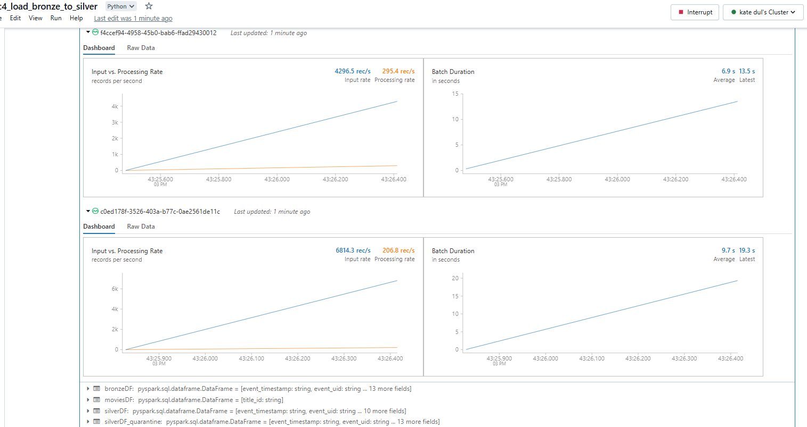
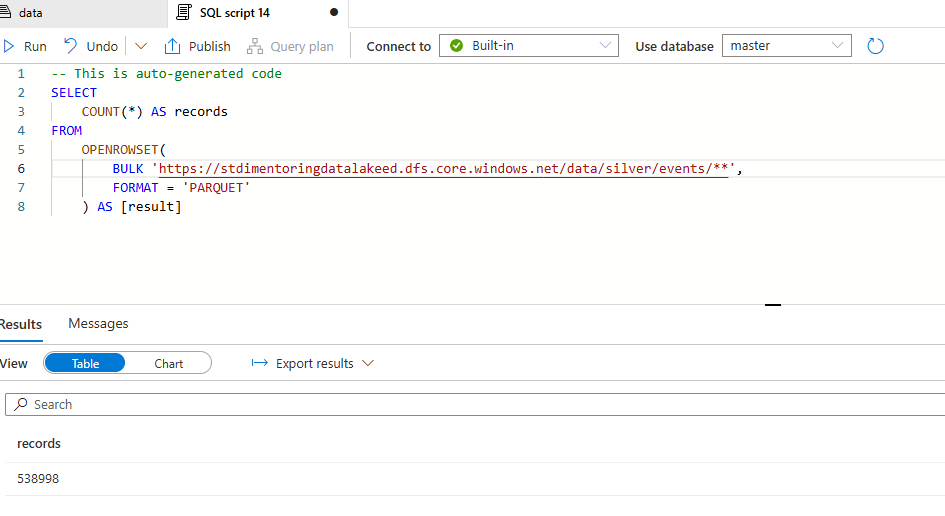
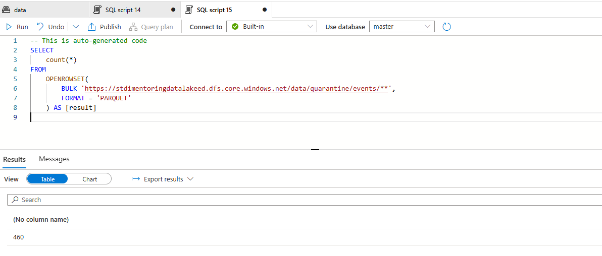
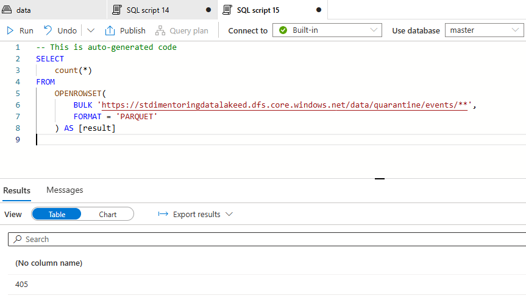
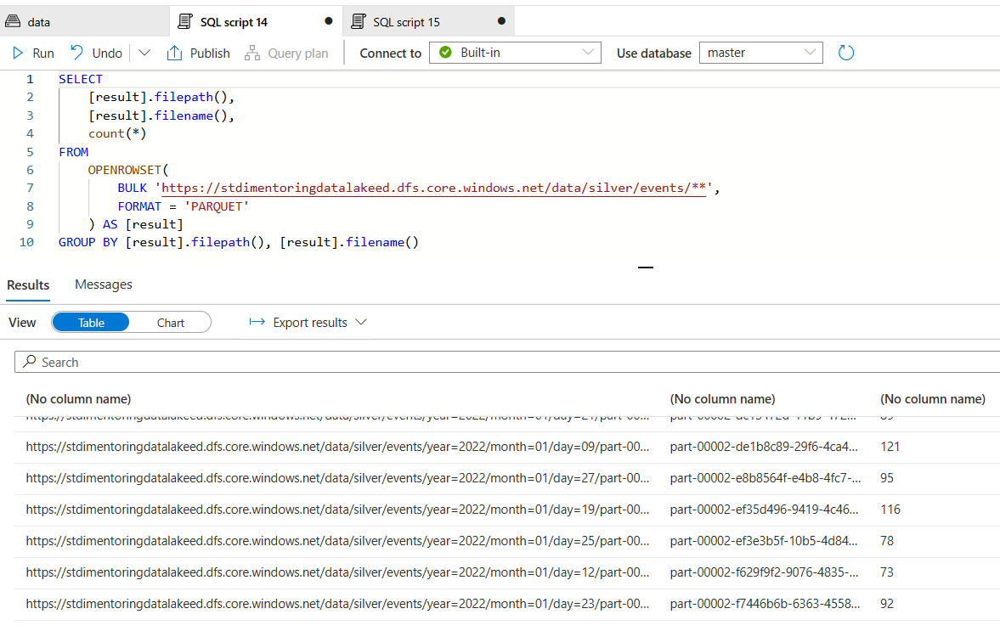

# Task 4.3 Databricks with Auto Loader (YouFlix Events Silver)

## Run Scenario:

1. Start your personal cluster.
2. Run `uc4_load_bronze_to_silver` notebook.
   

3. In Synapse Workspace, navigate to Data section, find in Linked tab your container, open “silver/events” and
   check number of rows using SQL query. The expected value is 538 998 rows. You should get this value if
   data in bronze layer is not changed after #4.2 completion.
4. Take a screenshot of SQL query with count value.
   

5. In Synapse Workspace, navigate to Data section, find in Linked tab your container, open
   “quarantine/events”, navigate to the latest subfolder and check number of rows using SQL query. The
   expected value is 460 rows.
6. Take a screenshot of SQL query with count value.
    

7. Run `uc4_load_bronze_to_silver` notebook again and make sure, that count values stay the same.
8. Go to the “EventHubSender\dummy_dir” folder and clear it. Copy to the folder files from
   “YouflixEvents\202202\” directory.
9. Start your streaming job from #4.2.
10. Execute “main.py” script from #4.1. Wait until it finishes. This time script execution might take about 10
    minutes. Wait at least 1 minute to let Stream Job to capture last messages from Event Hub.
11. Stop the job to avoid unnecessary expenses!!!
12. Run `uc4_load_bronze_to_silver` notebook.
13. Stop your cluster unnecessary expenses!!!
14. In Synapse Workspace, navigate to Data section, find in Linked tab your container, open “silver/events” and
    check number of rows using SQL query. The expected value is 1 020 719 rows.
15. Take a screenshot of SQL query with count value.
    

16. In Synapse Workspace, navigate to Data section, find in Linked tab your container, open
    “quarantine/events”, navigate to the latest subfolder and check number of rows using SQL query. The
    expected value is 405 rows.
17. Take a screenshot of SQL query with count value.
    

18. Write SQL query to get count of rows grouped by partition columns in “silver/events”. The query should
    return partitioning columns and row count in each partition.
19. Take a screenshot of SQL query with count values.
    
