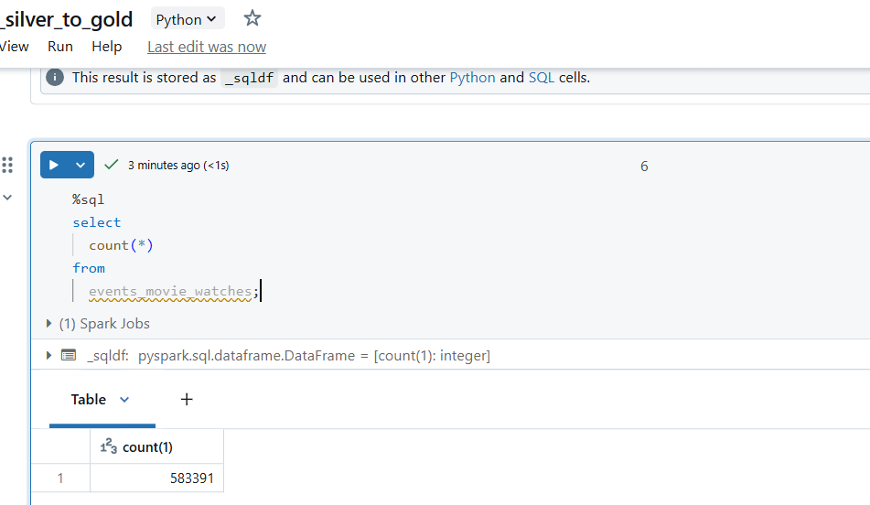
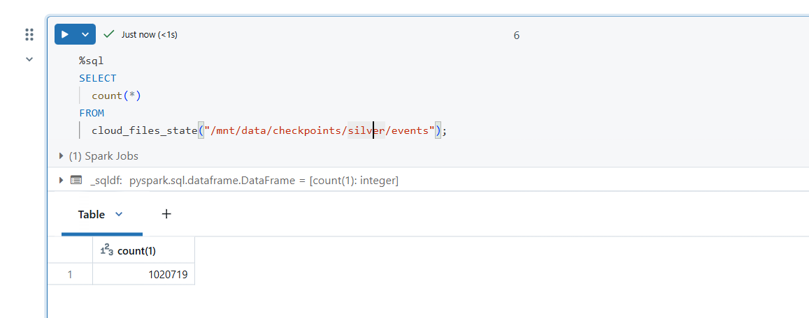
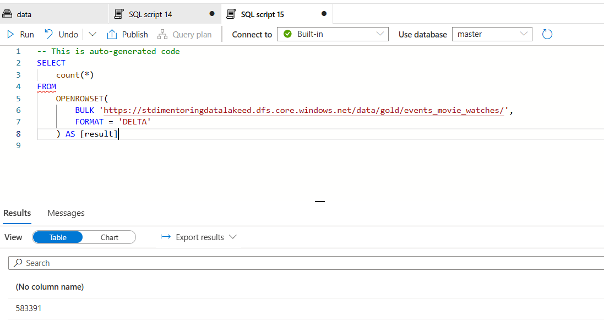
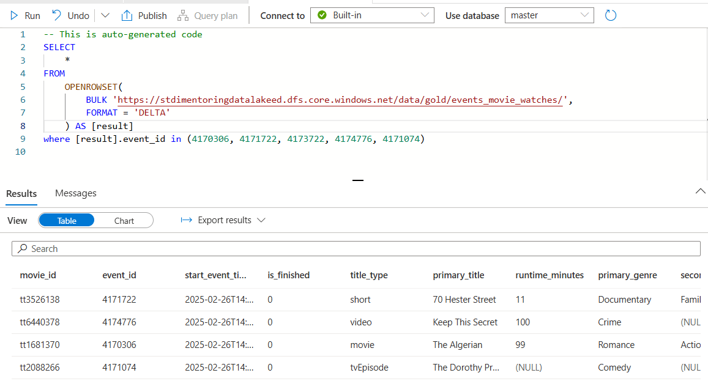
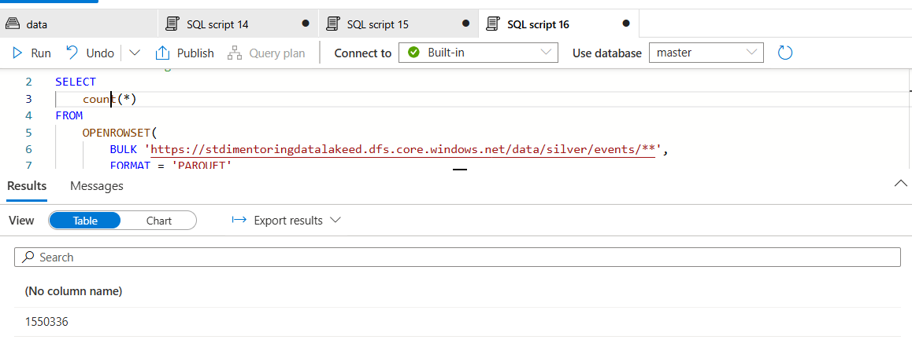
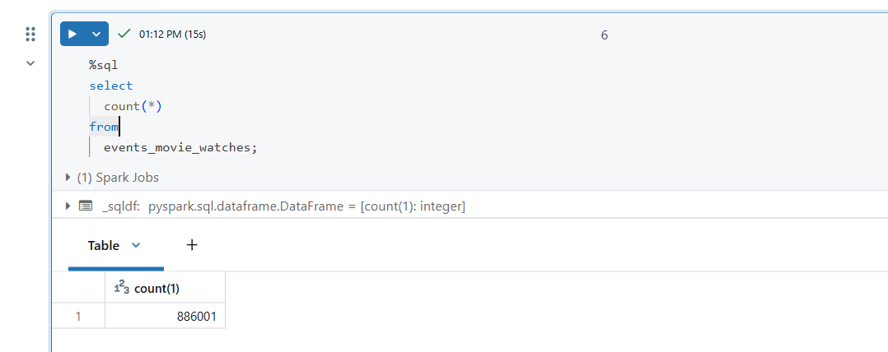
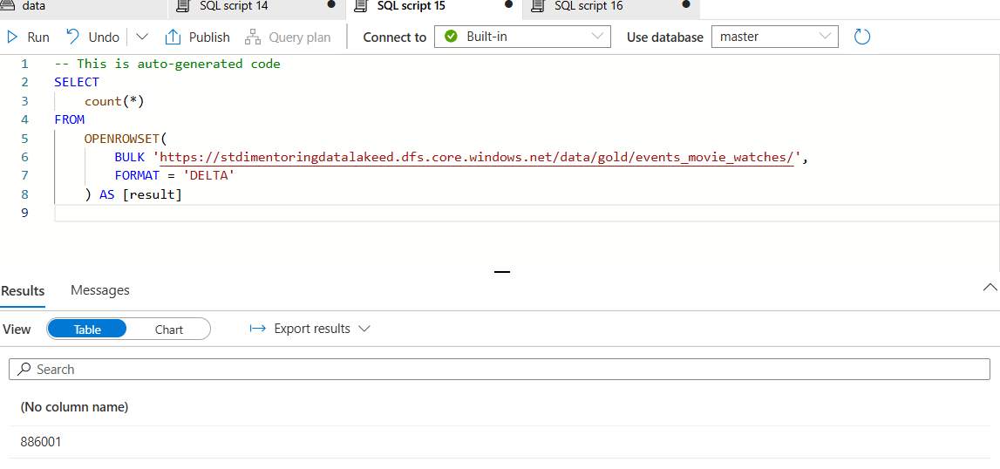
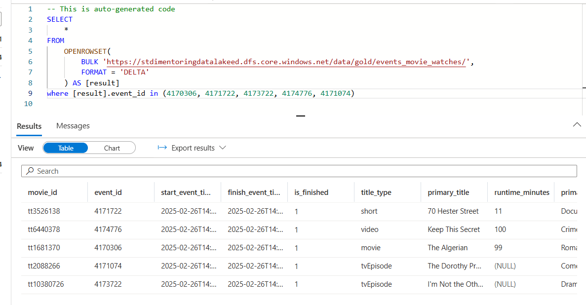

# Task 4.4 Databricks with Auto Loader (YouFlix Events Gold)

## Run Scenario:

1. Start your personal cluster.
2. Run `uc4_load_silver_to_gold` notebook.
3. In a Databricks notebook, write a SQL query to get number of rows in `events_movie_watches` table. The
   expected value is 583 391 rows. You should get this value if data in silver layer is not changed after #4.3
   completion.
4. Take a screenshot of SQL query with count value.
    

5. In a Databricks notebook, execute the following query:
    ```sql
   SELECT count(*) FROM cloud_files_state("/mnt/data/checkpoints/silver/events");
   ```
6. Take a screenshot of SQL query with count value.
   

7. In Synapse Workspace, navigate to Data section, find in Linked tab your container, open “gold/
   events_movie_watches” and check number of rows using SQL query. The expected value is 583 391 rows.
8. Take a screenshot of SQL query with count value.
    

9. Run `uc4_load_silver_to_gold` notebook again and make sure, that count values stay the same.
10. In Synapse Workspace, select a query to extract rows from “gold/events_movie_watches” with the
    following values of event_id: 4170306, 4171722, 4173722, 4174776, 4171074. These events should be
    unfinished.
11. Take a screenshot of SQL query with the results.
    

12. Go to the “EventHubSender\dummy_dir” folder and clear it. Copy to the folder files from
    “YouflixEvents\202203\” directory.
13. Start your streaming job from #4.2.
14. Execute “main.py” script from #4.1. Wait until it finishes. This time script execution might take about 10
    minutes. Wait at least 1 minute to let Stream Job to capture last messages from Event Hub.
15. Stop the job to avoid unnecessary expenses!!
16. Run `uc4_load_bronze_to_silver` notebook to write new events to silver layer.
17. In Synapse Workspace, navigate to Data section, find in Linked tab your container, open “silver/events” and
    check number of rows using SQL query. The expected value is 1 550 336 rows.
18. Take a screenshot of SQL query with count value.
    

19. Run `uc4_load_silver_to_gold` notebook to write new events to gold layer.
20. In a Databricks notebook, write a SQL query to get number of rows in `events_movie_watches` table. The
    expected value is 886 001 rows.
    

21. In a Databricks notebook, execute the following query:
    ```sql
    SELECT count(*) FROM cloud_files_state("/mnt/data/checkpoints/silver/events");
    ```
22. Take a screenshot of SQL query with count value.
    

23. Stop your cluster unnecessary expenses!!
24. In Synapse Workspace, navigate to Data section, find in Linked tab your container, open “gold/
    events_movie_watches” and check number of rows using SQL query. The expected value is 886 001 rows.
    

25. In Synapse Workspace, select a query to extract rows from “gold/events_movie_watches” with the
    following values of event_id: 4170306, 4171722, 4173722, 4174776, 4171074. These events should be
    finished.
26. Take a screenshot of SQL query with the results.
    