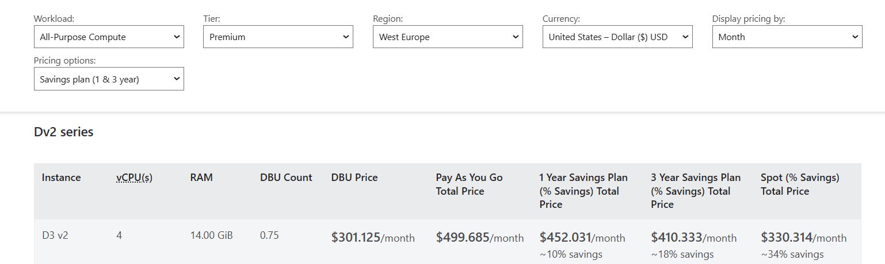
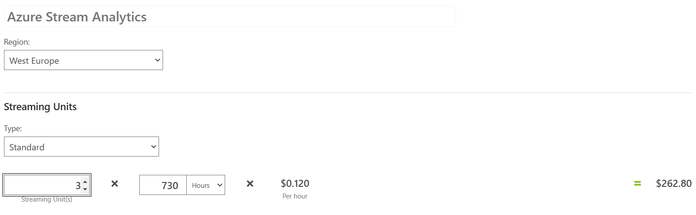
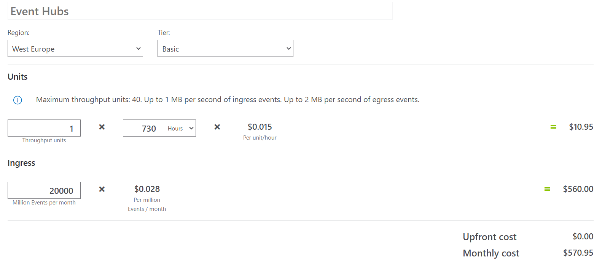

# Task 4.5 Cost Analysis

## Steps to complete the task:

1. Calculate monthly cost of Databricks clusters owning with the following assumptions:
   - A separate cluster is used for executing `uc4_load_bronze_to_silver` notebook.
   - A separate cluster is used for executing `uc4_load_silver_to_gold` notebook.
   - The clusters work 24/7.
   - You use Pay As You Go payment method.
   
   
    _DBU count for one instance `D3 v2` is 0.75 DBU. Since both clusters processing streaming data and working 
    24/7 with pay-as-you-go, therefore total costs for two clusters will be:_
    ```python 
    301.125$ * 2 = 602.25$
    ```
   
2. Calculate monthly cost of Stream Analytics job with the following assumptions:
   - Scale - 3 streaming units
   - The job works 24/7.
       

3. Calculate monthly cost of Event Hub with the following assumptions:
   - Pricing tier – Basic
   - Throughput Units – 1
   - Monthly number of events – 20'000'000'000
   
