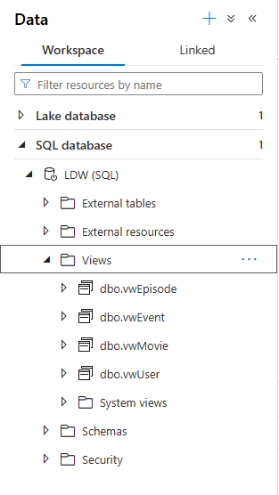
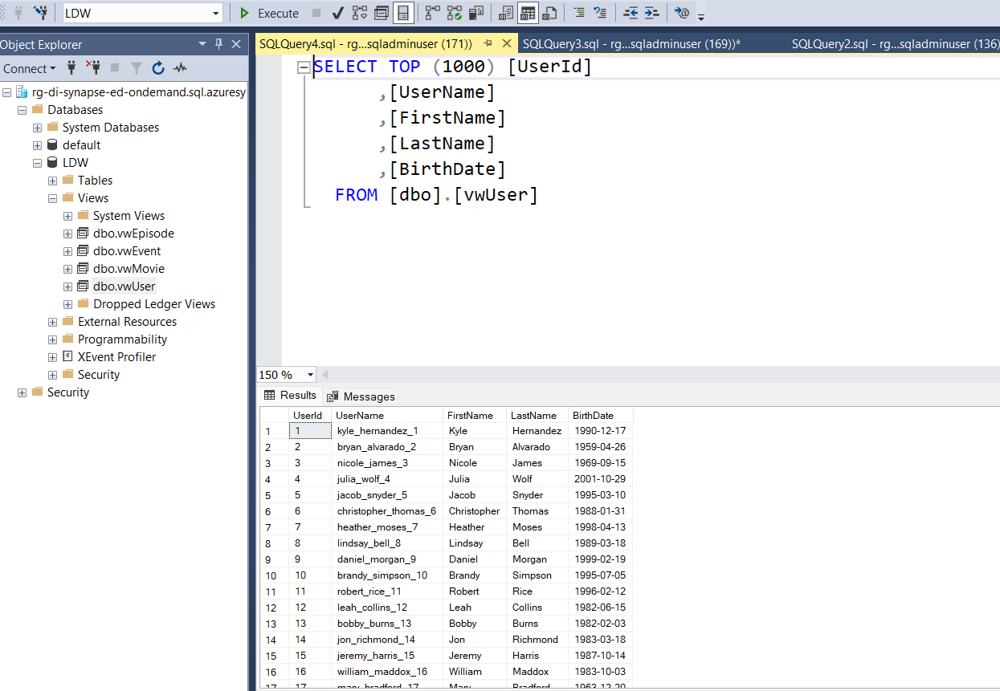

# Task 5.1 External View

## Run Scenario:

1. Open SQL Server Management Studio, connect to your Serverless SQL endpoint and find your views in
   `[LDW]` database.
2. Take a screenshot of list of views.
   
   

3. Select rows from each view, take a screenshot of results.
   
   
   
   

4. In SSMS, write a query against the `dbo.vwEvent`: get only events happened on ‘2022-01-01’. Use
   `[EventTimestamp]` column to apply a filter condition. Execute the query, navigate to the Messages tab, and
   pay attention on Total size of data scanned value. Take a screenshot of the Messages tab.
   

5. In SSMS, write a query against the `dbo.vwEvent`: get only events happened on ‘2022-01-01’. Use
   `[FilePathDate]` column to apply a filter condition. Execute the query, navigate to the Messages tab, and pay
   attention on Total size of data scanned value. Take a screenshot of the Messages tab.
   

6. Try to figure out why Total size of data scanned values are different. Put your explanation in the report.

   _Difference of files scanned caused by `partition pruning` (according to the following link for parquet and 
   delta formats Data Lake supports it: https://docs.azure.cn/en-us/synapse-analytics/sql/query-parquet-files,
   https://learn.microsoft.com/en-us/azure/synapse-analytics/sql/develop-tables-external-tables?tabs=hadoop#folder-partition-elimination), 
   which means that query uses metadata about partitioning during execution._ 

   _Therefore, since partitioning was done    with `[FilePathDate]` number of rows scanned is 0 -- simply, 
   such partition does not exist. However, there is no partitioning by `[EventTimestamp]`, therefore all data
   must be scanned in order to evaluate the query._

   
