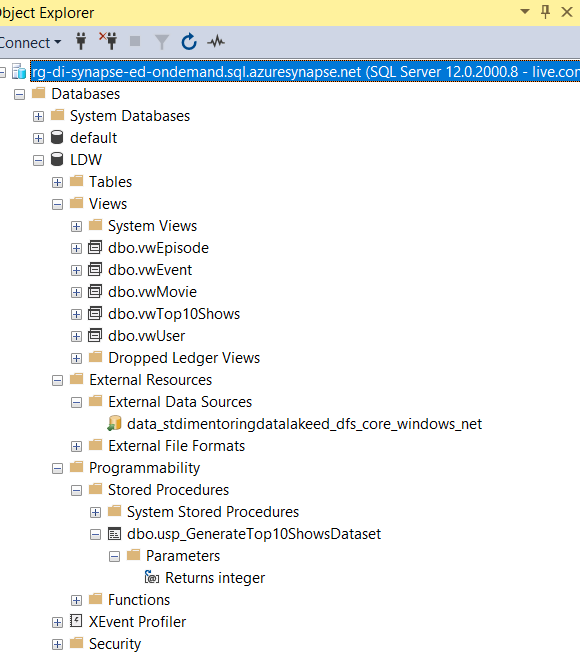
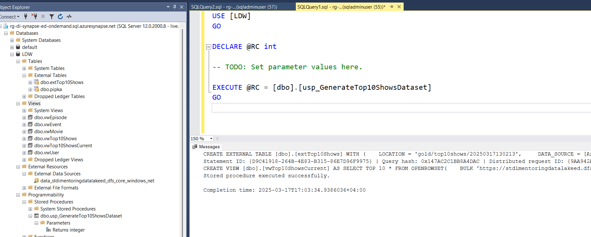
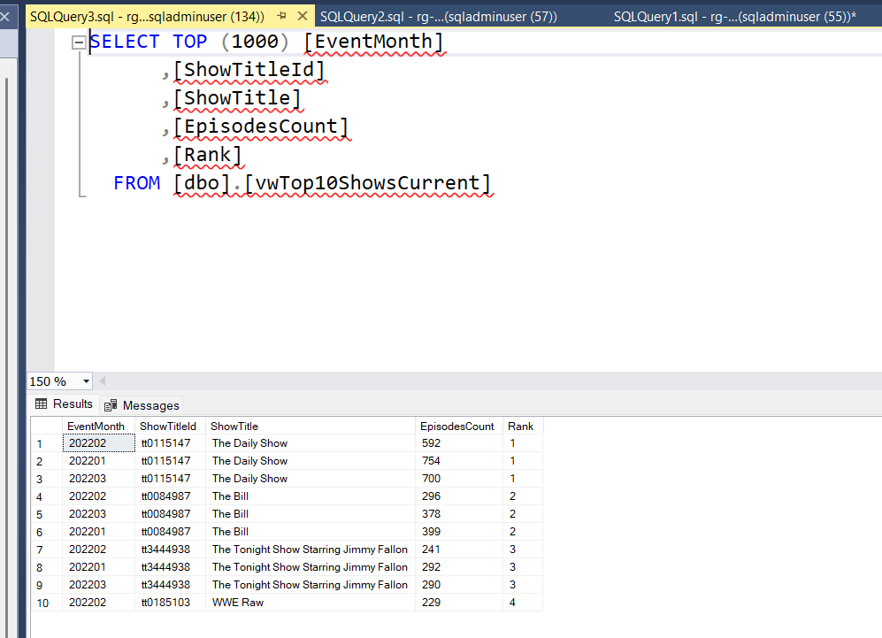

# Task 5.2  External Table

## Run Scenario:

1. Open SQL Server Management Studio, connect to your Serverless SQL endpoint and find your external
   table, `[dbo].[vwTop10ShowsCurrent]` view, `[dbo].[usp_GenerateTop10ShowsDataset]` procedure in `[LDW]`
   database.
2. Take a screenshot of your database objects.
   

3. In SSMS, execute your stored procedure.
   

4. Select rows from `[dbo].[vwTop10ShowsCurrent]` view, take a screenshot of results.
   