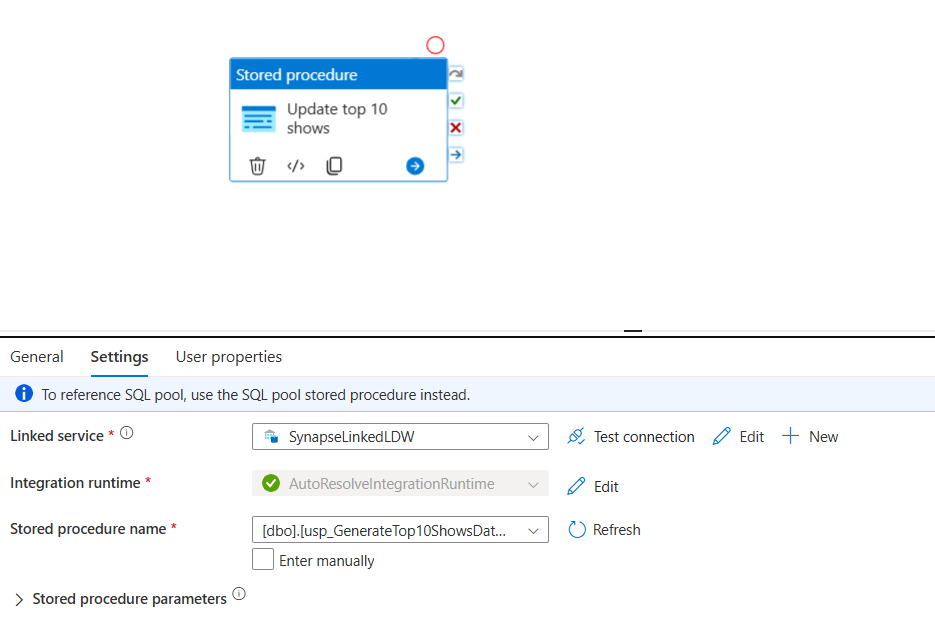
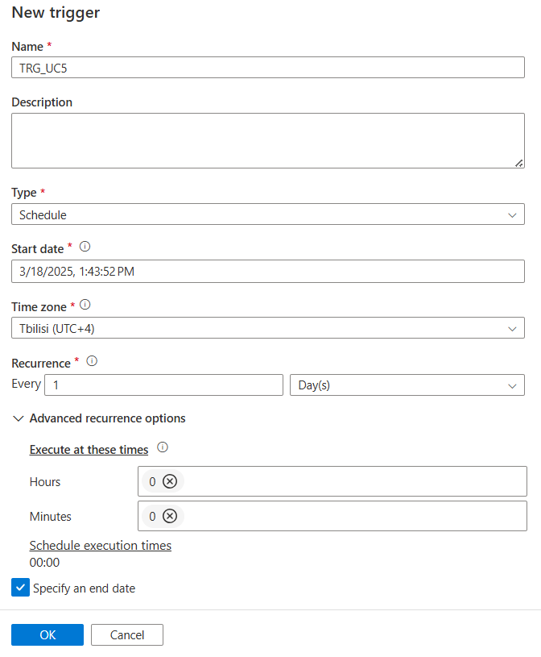
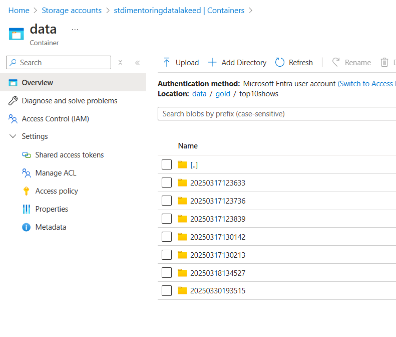
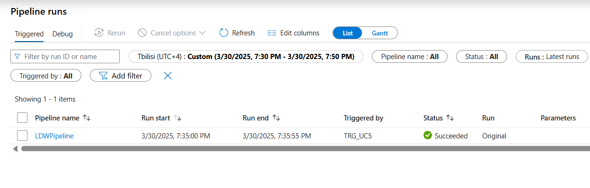

# Task 5.3 Synapse Pipeline with Stored Procedure Activity

## Run Scenario:

1. Take a screenshot of your pipeline.
    

2. Take a screenshot of your trigger settings.
    

3. Trigger your pipeline and take a screenshot of execution results.
    

4. Pipeline execution triggered by trigger:
    
    