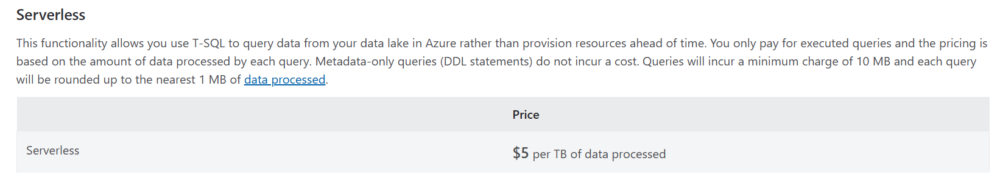

# Task 5.4 Cost Analysis

## Steps to complete the task:

1. Calculate monthly cost of SQL Serverless pool with the following assumptions:
   - Amount of data processed each month – 100 TB.

_According to the Azure Serverless SQL pool pricing, it will cost:_
```5 $/TB * 100 TB = 500 $```
